# Algebra de Boole
El algebra de Boole es la representación matemática de los sistemas digitales 
## Variables
Es un símbolo (principalmente letras mayúsculas) que representa una magnitud lógica.
```
AB
```
## Complemento
Inverso de una variable y se denota por la barra superior de las variables 
## Literal
Es la representación de una o más variables con o sin su complemento
## Suma Booleana
Una suma será igual a 1 cuando al menos uno de sus términos sea 1.
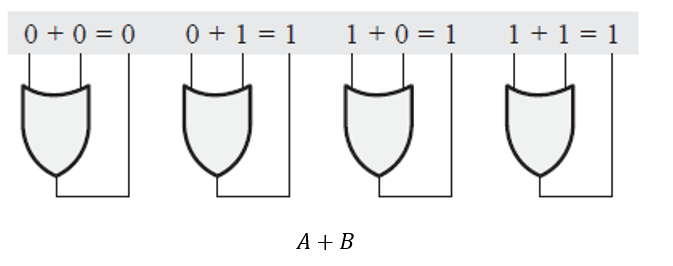
## Multiplicación booleana
Una multiplicación será igual a cero cuando al menos uno de sus términos sea igual a cero
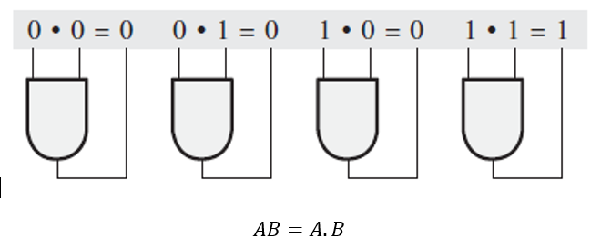
## Leyes del algebra de Boole
### Ley conmutativa 
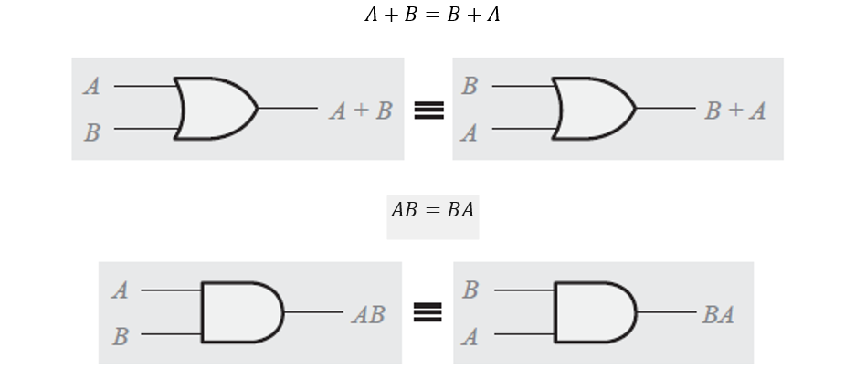
### Ley Asociativa
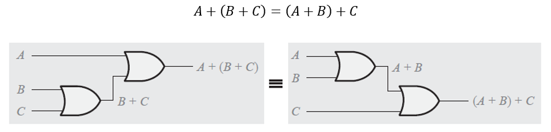
### Ley Distributiva
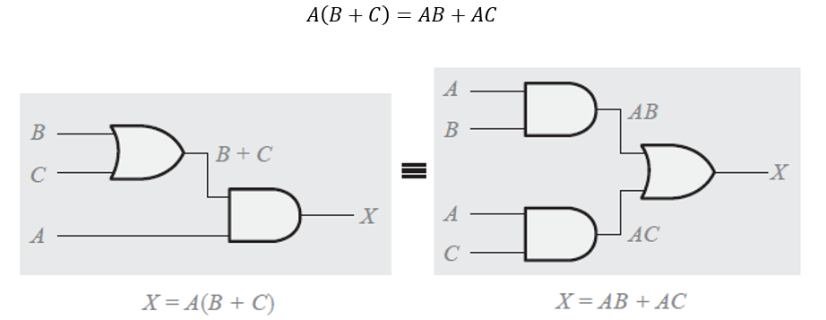
## Reglas del algebra de Boole
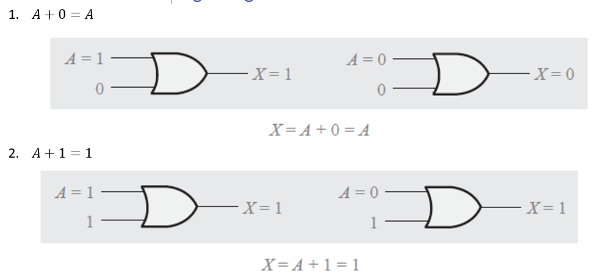
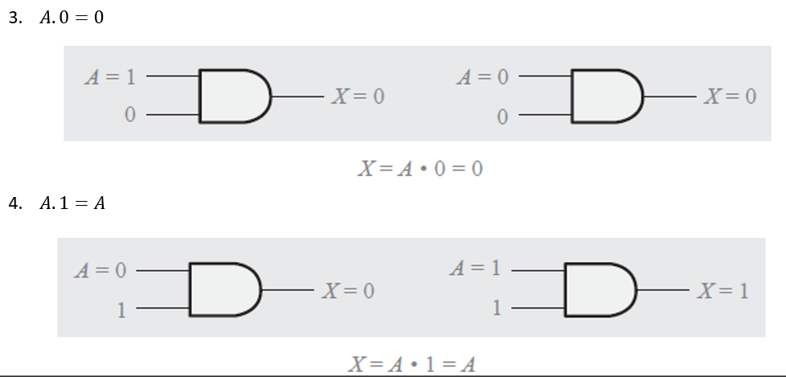
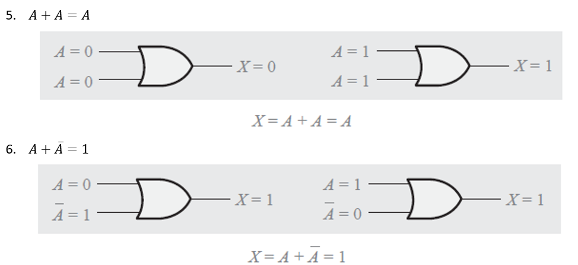
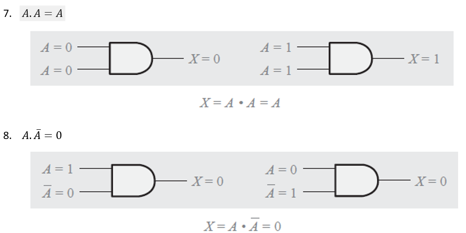
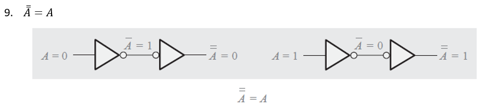
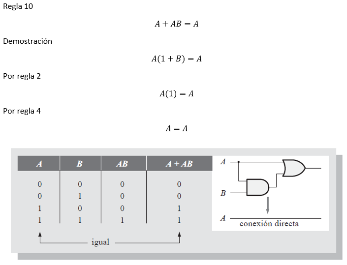
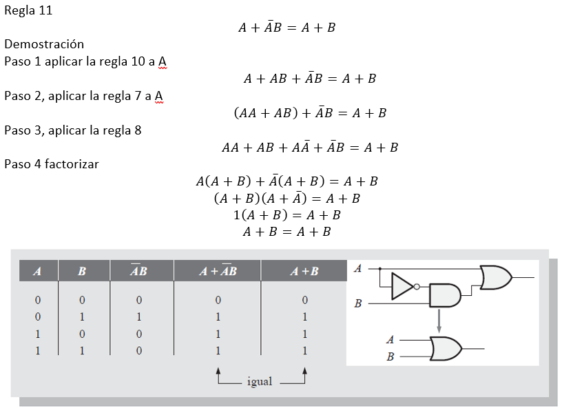
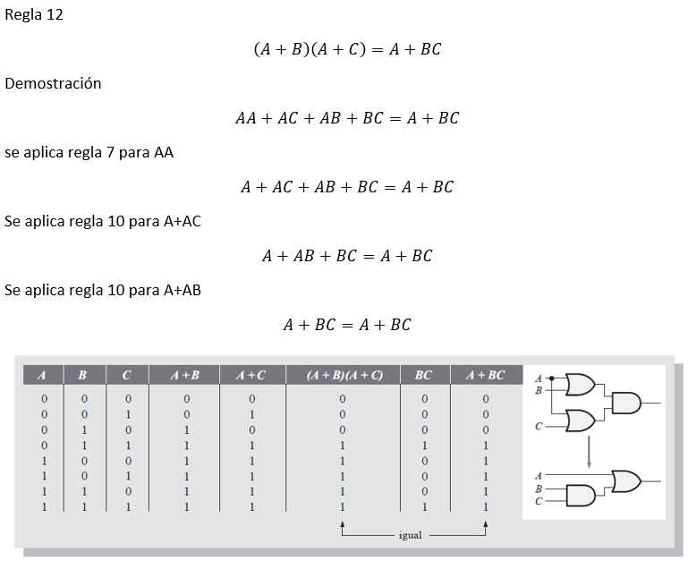
## Teoremas de DeMorgan
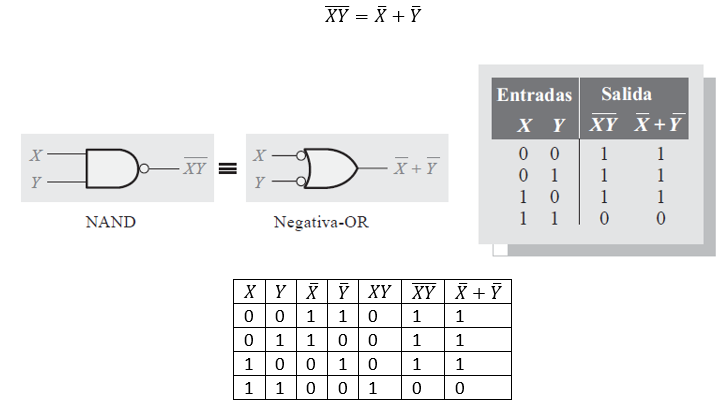
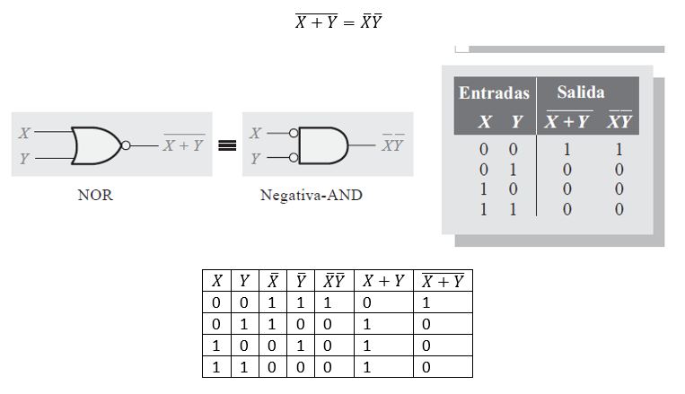
