# Flujo de diseño digital 

* **Especificación** Es la descripción detallada del comportamiento deseado en el circuito digital.
* **Diseño funcional** Describe a partir de diagramas de bloques y tablas de verdad la arquitectura del diseño y el comportamiento general.
* **Síntesis** Crea el circuito esquemático del diseño digital, es decir creal el circuito con sus respectivas compuertas y caminos.
* **Mapeo de tecnología** Seleccionar la tecnología de fabricación que se va a emplear en el diseño digital
* **Ubicar y Rutear** Consiste en la construcción del prototipo bien sea en protoboard o en silicio y su función parte de la utilización de los recursos.
* **Verificación** Comprobar la funcionalidad del prototipo.
* **Fabricación** Enviar aproducción el diseño digital 
## Ejemplo:
* **Especificación**: diseñar un circuito que detecte números primos en los primeros 7 número naturales, El circuito debe ser capaz de entregar su respuesta en menos de 200ns.
* **Diseño funcional**

    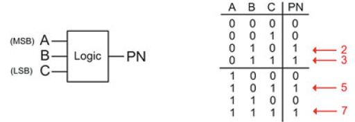

* **Síntesis**

    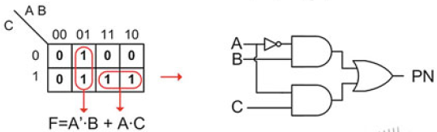

* **Mapeo de tecnología**

    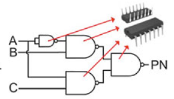

* **Ubicar y Rutear**

    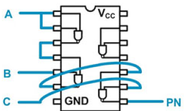

* **Verificación**

    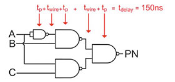

* **Fabricación**

    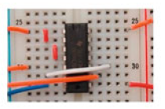

# Fundamentos de Verilog
* Verilog es un estándar IEEE cuya última actualización se realizó en el 2005. El lenguaje es sensible a mayúsculas y minúsculas y cada asignación, definición, o declaración debe terminar con punto y coma.

* Los comentarios en Verilog se pueden hacer de dos maneras:
    - Comentario de línea (//) con dos slashes al inicio
    - Comentario de bloque (/*   */)
* Todas las definiciones de nombres hechas por el usuario deben iniciar con una letra.
* Las definiciones de usuario no pueden ser las mismas que las palabras reservadas por el lenguaje.
## Tipos de datos 
En verilog cada señal, constante, variable o función debe estar asignada a algún tipo de dato. Dentro del estándar IEEE 1394-2005 están predefinidos algunos tipos de datos, de los cuales unos de ellos son sintetizables mientras que otros se utilizan únicamente para modelar de forma abstracta el comportamiento de un elemento.
### Conjunto de valores en Verilog 
Verilog soporta cuatro tipos de valores básicos que pueden ser asignadas a la mayoría de tipos de datos predefinidos en el lenguaje.
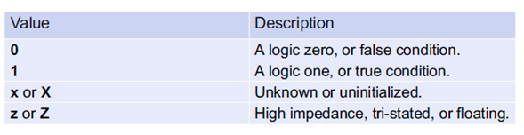

Estos valores a su vez están asociados a un nivel de “fuerza (strenght)”, estos son usados para resolver el valor de una señal cuando esta es manipulada por múltiples fuentes. Los nombres, sintaxis y fuerzas relativas son:
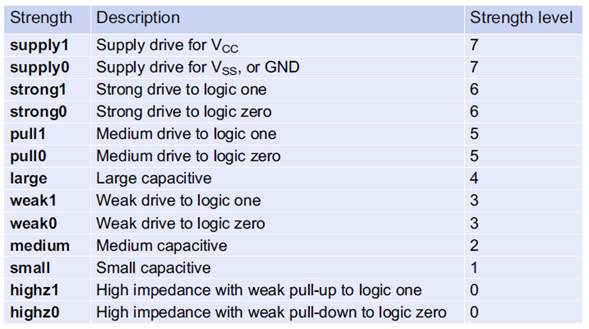

Cuando una señal es manipulada por múltiples fuentes esta obtendrá su valor de la fuente con el nivel de fuerza más alto. Por defecto si no se especifica será asignada por defecto a 6.

### Net data types (tipos de datos de red)

Los tipos de dato de red (**NET**) modelan una interconexión entre componentes y pueden tomar valores de 1, 0, X, Z. Una señal del tipo **NET** debe ser manipulada y actualizada cada vez que la fuente cambie. El tipo de dato **NET** más común en Verilog es **wire** a continuación encontramos los otros tipos **NET**: 

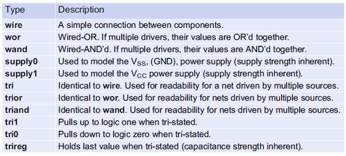

### Tipos de datos de variables 
 Verilog contiene tipos de datos para modelar almacenamiento. Estas variables pueden tomar valores de 0, 1, X, Z pero no tienen asociado ninguna fuerza. Las variables mantendrán su valor hasta no ser actualizadas.
 
 

 ### Vectores
 En Verilog, un vector es un arreglo unidimensional de elementos. Todos los datos tipo **NET** y las variables del tipo **reg** pueden ser usadas en forma de vectores. Su sintaxis es:
 ```verilog
 <type> [<MSB_index>:<LSB_index>]vector_name
 ```
 Los índices pueden ser pueden tomar cualquier número entero, pero usualmente se usa el LSB en 0, ejemplo:
 ```verilog
wire [7:0] Sum; 		// This defines an 8-bit vector called “Sum” of type wire. The
                        // MSB is given the index 7 while the LSB is given the index 0.
reg [15:0] Q; 		    // This defines a 16-bit vector called “Q” of type reg.
```
los bits individuales de un vector pueden ser seleccionados usando su índice, ejemplo:
```verilog
Sum[0]; 			// This is the least significant bit of the vector “Sum” defined above.
Q[15:8]; 			// This is the upper 8-bits of the 16-bit vector “Q” defined above.
```
### Arreglos
Los arreglos de Verilog son agrupaciones multidimensionales de elementos y se pueden entender como una agrupación de vectores. La sintaxis de los arreglos es:
```verilog
<type> [<MSB_index>:<LSB_index>] array_name [<array_start_index>: <array_end_index>];
```
Ejemplo:
```verilog
reg[7:0] Mem[0:4095]; 		// Defines an array of 4096, 8-bit vectors of type reg.
integer A[1:100]; 			// Defines an array of 100 integers.
```
Ejemplo:
```verilog
reg[7:0] Mem[0:4095]; 		// Defines an array of 4096, 8-bit vectors of type reg.
integer A[1:100]; 			// Defines an array of 100 integers.
```
para acceder a los elementos de un arreglo se utilizan los índices de la siguiente manera:
```verilog
Mem[2]; 		    // This is the 3rd element within the array named “Mem”.
                    // This syntax represents an 8-bit vector of type reg.
Mem[2][7]; 			// This is the  MSB of the 3rd element within the array named “Mem”.
                    // This syntax represents a single bit of type reg.
A[2]; 				// This is the 2nd element within the array named “A”. Recall
                    // that A was declared with a starting index of 1.
                    // This syntax represents a 32-bit, signed integer.
```
### Expresando números en diferentes bases 
Los números enteros se escriben directamente sin ningún tipo de sintaxis, sin embargo, Verilog soporta la definición de números en diferentes bases con opción de tamaño en bits y signo su sintaxis es:
```verilog
<size_in_bits>’<base><value>
```
La especificación de tamaño es opcional y si esta es omitida por defecto el lenguaje asigna un vector de 32 bits. Las sintaxis para diferentes bases son:

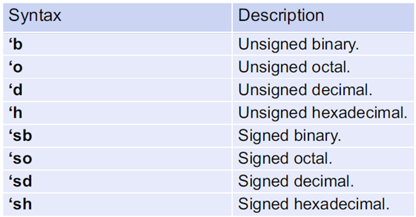

Ejemplo:
```verilog
10 			    // This is treated as decimal 10, which is a 32-bit signed vector.
4’b1111 		// A 4-bit number with the value 1111.
8’b1011_0000 	// An 8-bit number with the value 10110000.
8’hFF 			// An 8-bit number with the value 11111111.
8’hff 			// An 8-bit number with the value 11111111.
6’hA 			// A 6-bit number with the value 001010. Note that leading zeros 
                // were added to make the value 6-bits.
8’d7 			// An 8-bit number with the value 00000111.
32’d0 			// A 32-bit number with the value 0000_0000.
‘b1111 			// A 32-bit number with the value 0000_0000_0000_0000_0000_0000_0000_1111.
8’bZ 			// An 8-bit number with the value ZZZZ_ZZZZ
```
### Asignación entre diferentes tipos
Verilog se reconoce como un lenguaje débilmente tipado lo que significa que permite la asignación entre diferentes tipos de datos de forma directa y esto se debe a que se realiza la asignación directamente en bits, ejemplo:
```verilog
ABC_TB = 2’b00; 	// ABC_TB will be assigned 3’b000. A leading bit is automatically added.
ABC_TB = 5; 		// ABC_TB will be assigned 3’b101. The integer is truncated to 3-bits.
ABC_TB = 8; 		// ABC_TB will be assigned 3’b000. The integer is truncated to 3-bits.
```
## Construcción de módulos en verilog 
Un diseño en Verilog describe un sistema sencillo en un único archivo, este tiene la extensión “.v”. Dentro del archivo la descripción es contenida en un módulo el cual contiene la interfaz del sistema (entradas, salida, etc …) y la descripción del comportamiento: 

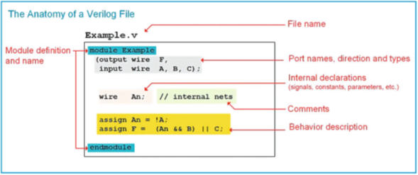

### El módulo
Todos los sistemas en Verilog están encapsulados dentro de un módulo el cual puede incluir instanciaciones de módulos de bajo nivel de forma que se puedan realizar diseños de forma jerárquica, las palabras reservadas ***module*** y ***endmodule*** representan el principio y fin de la descripción de un sistema, la sintaxis de los módulos es:

```verilog
module module_name (port_list and port_definitions); 
// module_items
endmodule
```
### Definición de puertos 
El primer elemento a tener en cuenta en un módulo es la definición de entradas y salidas o de los puertos, estos deben tener un nombre que es susceptible a mayúsculas y minúsculas y deben iniciar con una letra, un sentido y un tipo. 
El sentido puede ser ***in***, ***out***, ***inout***
Los puertos pueden ser definidos de cualquier tipo mencionado anteriormente pero únicamente los ***wire***, ***reg*** y ***integer*** son sintetizables.

Ejemplo:

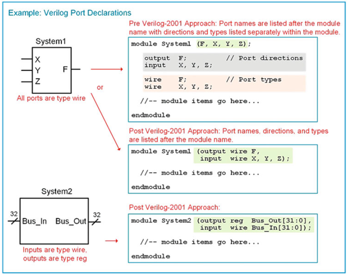

### Declaración de señales 
Las señales son usadas para conexiones internas, deben ser declaradas antes de usarlas y requieren de un tipo y de un nombre o identificador. Su sintaxis es:
```verilog
<type> name;
```
Ejemplo:
```verilog
wire node1; 		    // declare a signal named “node1” of type wire
reg Q2, Q1, Q0; 		// declare three signals named “Q2”, “Q1”, and “Q0”, all of type reg
wire [63:0] bus1; 		// declare a 64-bit vector named “bus1” with all bits of type wire
integer i,j; 		    // declare two integers called “i” and “j”
```
Verilog soporta diseños con aproximación jerárquica por lo cual se hace necesario utilizar señales para conectar los subsistemas existentes en el módulo, ejemplo:


* En la imagen anterior las señales ***n1*** y ***n2*** son las que permiten conectar ***sub1*** y ***sub2***.
* La señal ***n1*** que está afuera del sistema 3 puede coexistir con la señal ***n1*** interna ya que pertenecen a módulos diferentes.
* No es necesario declarar señales para conectar los puertos de entrada y salida del sistema 3 con los subsistemas.
* Las entradas de los subsistemas se pueden llamar igual ya que cada definición de estos puertos se encuentra en módulos separados.

### Declaración de parámetros 
Un parámetro o constante es un elemento útil para representar cantidades que serán usadas varias veces en la arquitectura, su sintaxis es:
```verilog
parameter <type> constant_name = <value>;
```
el parámetro es opcional y únicamente puede ser: **integer**, **time**, **real**, **realtime**, si el tipo es omitido, el parámetro obtendrá por defecto el tipo del valor asignado, ejemplo:
```verilog
parameter BUS_WIDTH = 64;
parameter NICKEL = 8’b0000_0101;
```
Una vez declaradas las contantes estas pueden ser usadas en todo el módulo de la siguiente manera:
```verilog
wire [BUS_WIDTH-1:0] BUS_A; 
```
En el ejemplo anterior notamos que se usa el parámetro para definir el tamaño del vector, si asumimos que ***BUS_WIDTH*** tiene un valor de 64 entonces ***BUS_A*** tendrá un tamaño de 64 bits. Se debe tener en cuenta que al valor ***BUS_WIDTH*** se le debe restar 1 ya que el inicio del índice del vector es 0.