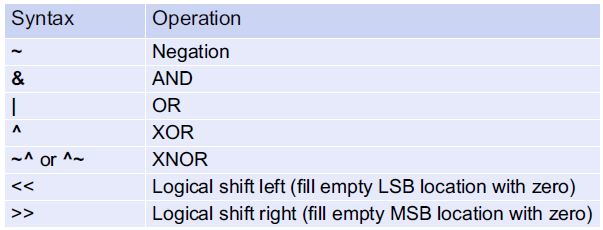
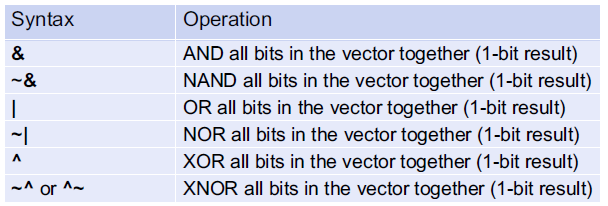
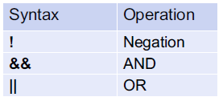
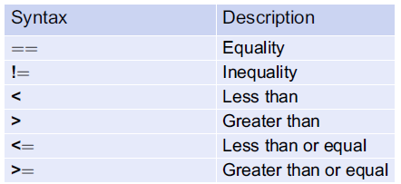
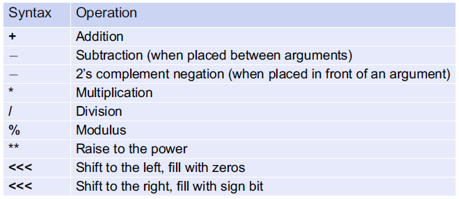
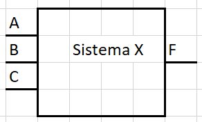
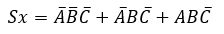
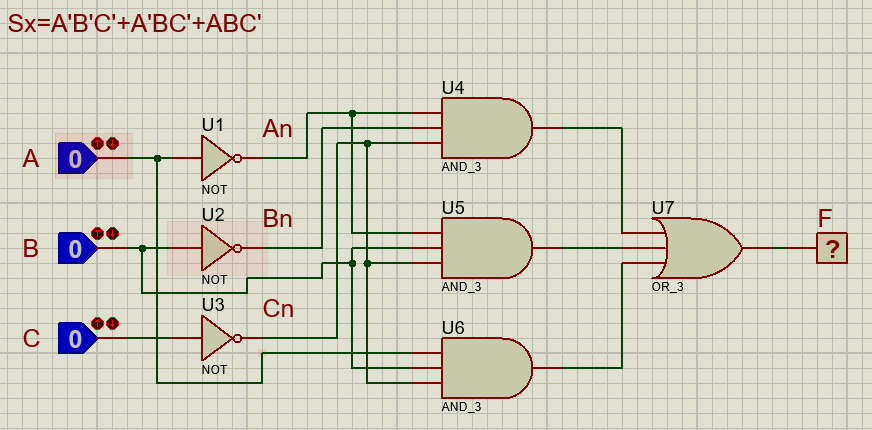

# Operadores en Verilog
Existe una gran variedad de operadores definidos en el estándar de Verilog, sin embargo, no todos los operadores trabajan sobre todos los tipos de datos y, además, no todos son sintetizables.
## Operadores de asignación
En Verilog se usa el signo ***(=)*** para denotar asignación, de esta forma, el lado izquierdo de la expresión **(LHS  Left-Hand Side)** será el objetivo de la asignación, mientras el lado derecho **(RHS Right-Hand Side)** contiene los ***signals***, ***constants***, ***operators*** que serán asignados. 

Ejemplo:
```verilog
F1 = A;		// F1 es asignado con la señal A
F2 = 8'hAA;	// F2 es un vector de 8 bits que tendra un valor de  1010_1010
```
## Asignación continua 
Verilog usa la palabra reservada ***assign*** para ejecutar la asignación continua de una señal, esta asignación continua se hace de igual manera con el símbolo ***(=)***.

El **LHS** es el objetivo de la asignación continua y debe ser del tipo ***net*** mientra que el **RHS** contiene los argumentos de entrada que pueden ser ***regs***, ***constants***, y ***operators***. 

La asignación continua modela lógica combinacional y cualquier cambio que se realice en el **RHS** actualizara inmediatamente el ***net*** del **LSH**. Para que el ***net*** se actualice de forma correcta debe ser declarado previamente antes de la primera actualización.

Ejemplo:
```verilog
assign F1 = A; 		// F1 se actualiza con cualquier cambio de A, A debe ser un signal
assign F2 = 1'b0;	// a F2 se asigna continuamente el valor de 0
assign F3 = 8'hAA; 	// F3 es un vector de 8 bits que continuamente está siendo asignado con 10101010
```

Cada asignación continua será ejecutada concurrentemente y sintetizada como un circuito lógico separado, por ejemplo:
```verilog
assign X = A;
assign Y = B;
assign Z = C;
```
Cuando esta asignación continua es sintetizada y simulada, estas tres líneas de Verilog construirán tres ***wire*** que se actualizarán exactamente al mismo tiempo con las respectivas ***signals***, muy diferente de un lenguaje de programación que, por el contrario, primero ejecutará la línea uno, después la línea dos y por último la línea tres de manera secuencial.

Ejemplo 2: 
```verilog
assign A = B;
assign B = C;
```
A nivel de simulación, la asignación continua de C a B y de B a A tendrá lugar exactamente al mismo tiempo, por otro lado, en síntesis, la señal B será eliminada del diseño ya que su funcionalidad describe dos ***wire*** en serie. 

## Operadores lógicos Bitwise
En Verilog los operadores Bitwise desarrollan operaciones lógicas bit a bit. En caso que las entradas de la operación sean vectores cada bit en el primer vector será operado con el bit de la misma posición del segundo vector. Si los vectores no son del mismo tamaño, el vector más pequeño será ajustado con ceros a la izquierda para que quede del mismo tamaño del vector más grande.



Ejemplo
```verilog
~X 		    // invierte cada bit en X
X & Y 		// AND entre cada bit de X y cada bit de Y
X | Y 		// OR entre cada bit de X y cada bit de Y
X ^ Y 		// XOR entre cada bit de X y cada bit de Y
X ~^ Y 		// XNOR entre cada bit de X y cada bit de Y
X << 3 		// desplaza X tres veces a la izquierda y llena con ceros 
Y >> 2 		// desplaza Y dos veces a la derecha y llena con ceros
```

## Operadores de reducción lógica
Un operador de reducción es aquel que usa cada bit de un vector como entrada a una operación lógica que produce solo un bit de salida.



Ejemplo:
```verilog
&X 		// AND entre todos los bits del vector X, da como resultado un único bit
~&X 		// NAND entre todos los bits del vector X, da como resultado un único bit
|X 		// OR entre todos los bits del vector X, da como resultado un único bit
~|X 		// NOR entre todos los bits del vector X, da como resultado un único bit
^X 		// XOR entre todos los bits del vector X, da como resultado un único bit
~^X 		// XNOR entre todos los bits del vector X, da como resultado un único bit
```

## Operadores lógicos booleanos
Un operador lógico Booleano es aquel que retorna un resultado de verdadero o falso de acuerdo con la evaluación de las condiciones de entrada.



## Operadores de relación 
El operador de relación retorna un valor de verdadero o falso basado en la comparación de dos entradas.



Ejemplo:
```verilog
X == Y 		// Verdadero si X es igual a Y, falso de cualquier otra manera.
X != Y 		// Verdadero si X es diferente a Y, falso de cualquier otra manera.
X < Y 		// Verdadero si X es menor que Y, falso de cualquier otra manera.
X > Y 		// Verdadero si X es mayor que Y, falso de cualquier otra manera.
X <= Y 		// Verdadero si X es menor o igual que Y, falso de cualquier otra manera.
X >= Y 		// Verdadero si X es mayor o igual que Y, falso de cualquier otra manera.
```

## Operadores condicionales 
Verilog contiene operadores condicionales ***(?)*** que pueden ser usados para proveer una aproximación más intuitiva al modelamiento de declaraciones lógicas, su sintaxis es:
```verilog
<net_objetivo> = <condición_booleana> ? <valor_verdadero> : <valor_falso>;
```
Este operador evalúa una ***condición_booleana***, en caso de ser verdadera el ***valor_verdadero***  se asignará a ***net_objetivo*** de lo contrario, el ***valor_falso*** será asignado. Los valores de asignación pueden ser señales o valores lógicos.

Ejemplos:
```verilog
// Si A es cero, F=1, de lo contrario F=0. Esta condición modela un inversor
F = (A==1'b0) ? 1'b1 : 1'b0;

// si sel es cero, F=A, de lo contrario F=B. Esta condición modela un interruptor de selección
F = (sel ==1'b0) ? A : B; 

// concatenación de condicionales. Esta condición modela una compuerta XOR
F = ((A == 1'b0) && (B == 1'b0)) ? 1'b0 : 	
    ((A == 1'b0) && (B == 1'b1)) ? 1'b1 : 
    ((A == 1'b1) && (B == 1'b0)) ? 1'b1 :
    ((A == 1'b1) && (B == 1'b1)) ? 1'b0;

// esta condición modela la expresión F = C’(A’+B)
F = ( (!A && B) || (A && C) ) ? 1'b1 : 1'b0; 
```

## Operadores de concatenación 
En Verilog los corchetes ***( { } )*** son usados para concatenar multiples señales, el objetivo de esta operación debe ser del mismo tamaño que la suma de los argumentos de entrada, ejemplo:
```verilog
//Si se asume que Bus1, Bus2, Bus3 son vectores de 8 bits entonces esta operación toma los 4 bits de mayor peso de Bus2, los concatena con los 4 bits de menor peso de Bus3 y los asigna a Bus1
Bus1[7:0] = {Bus2[7:4], Bus3[3:0]};

//Si BusA y BusB son de 4 bits entonces BusC debe ser de 8 bits
BusC = {BusA, BusB};

//Esta operación completa el vector de 4 bits BusA con 4 ceros y lo asigna BusC
BusC[7:0] = {4'b0000, BusA};
```

## Operador de replicación
Verilog posee un operador que permite concatenar un vector con si mismo que se denomina *” operador de replicación”*, este operador usa doble corchete ***( { { } } )*** y un número entero que determina las veces que se va a replicar el vector. Su sintaxis es:
```verilog
{<numero_replicaciones>{<vector_a_replicar>}}
```

Ejemplo:
```verilog
BusX = {4{Bus1}};               // Esto es equivalente a: BusX = {Bus1, Bus1, Bus1, Bus1};

BusY = {2{A,B}};                // Esto es equivalente a: BusY = {A, B, A, B};

BusZ = {Bus1, {2{Bus2}}};       // Esto es equivalente a: BusZ = {Bus1, Bus2, Bus2};
```
## Operadores numéricos
Los operadores numéricos son: 



Ejemplo

```verilog
X + Y 			// suma X con Y
X - Y 			// Resta Y de X
-X 			    // Aplica el complemento a 2 de X 
X * Y 			// Multiplica X por Y
X / Y 			// Divide X entre Y
X % Y 			// Modulo de X/Y
X ** Y 			// X Elevado a la Y
```

En Verilog se permite el uso de estos operadores con argumentos de diferente tamaño, tipo y signo bajo las siguientes reglas

* Si dos vectores son de diferente tamaño el vector más pequeño se expande al tamaño del vector más grande
    - Si el vector más pequeño es sin signo, se completa con ceros a la izquierda.
    - Si el vector más pequeño es con signo, este se completa con los bits de signo.
* Si uno de los argumentos es real entonces la aritmética se realizará bajo números reales.
* Si uno de los argumentos es sin signo entonces todos los argumentos se tratarán como sin signo.

Ejemplo

Implementar un circuito digital combinacional cuyo comportamiento sea el siguiente:

aqui va la tabla

* Diagrama en bloques

    

* Función lógica

    

* Circuito 

    

* Verilog 
```verilog
module SistemaX(input wire A, B, C,
                output wire F);

// Señales
wire An, Bn, Cn;
wire m0, m1, m2;

// complementos
assign An = ~A;
assign Bn = ~B;
assign Cn = ~C;

//Multiplicaciones
assign m0 = An & Bn & Cn;
assign m1 = An & B & Cn;
assign m2 = A & B & Cn;

//Suma
assign F = m0 | m1 | m2;

endmodule
```
Opción 2
```verilog
module SistemaX(input wire A, B, C,
                output wire F);

assign F = (( !A && !B && !C) || ( !A && B && !C) || ( A && B && !C)) ? 1'b1 : 1'b0; 

endmodule
```
