# Boolean Algebra
Boolean algebra is the mathematical representation of digital systems. 
## Variables
It is a symbol (mainly uppercase letters) that represents a logical value.
```
AB
```
## Complement
The inverse of a variable, denoted by a bar over the variable. 
## Literal
It is the representation of one or more variables, with or without their complements.
## Boolean addition
A Boolean sum will be equal to 1 when at least one of its terms is 1.
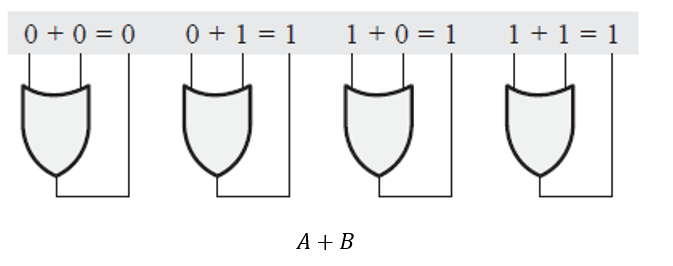
## Boolean multiplication
A Boolean multiplication will be equal to zero when at least one of its terms is equal to zero.
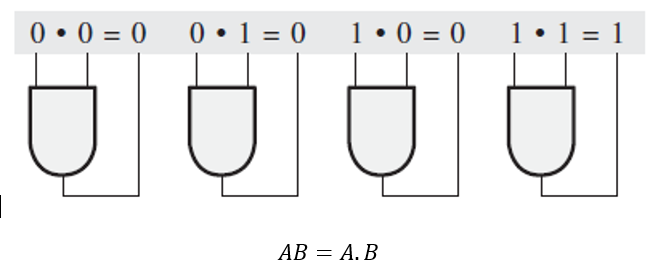
## Laws of Boolean Algebra
### Commutative law 
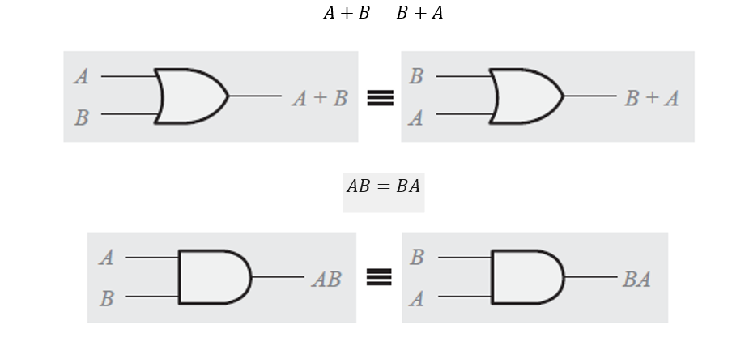
### Associative law
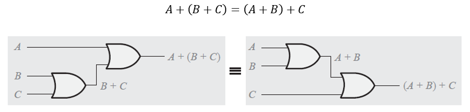
### Distributive law
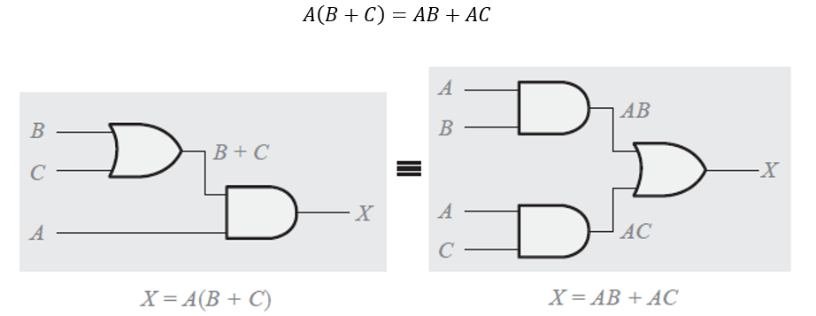
## Rules of Boolean Algebra
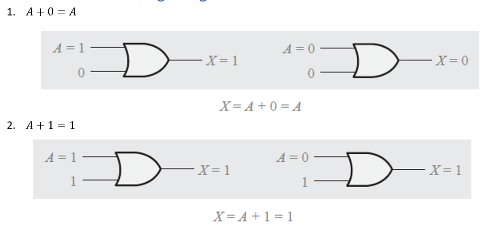
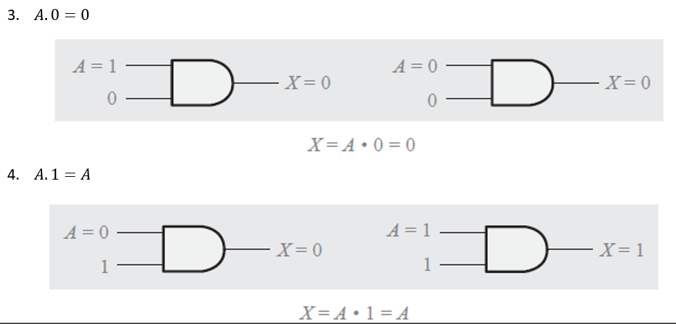
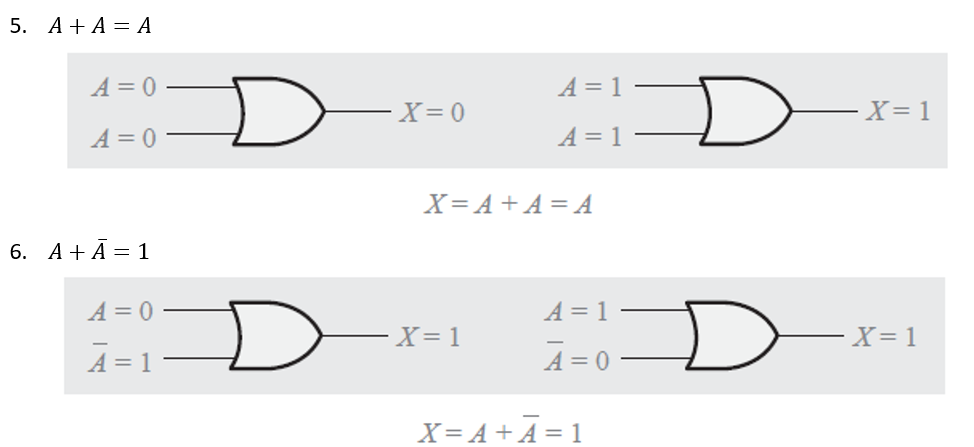
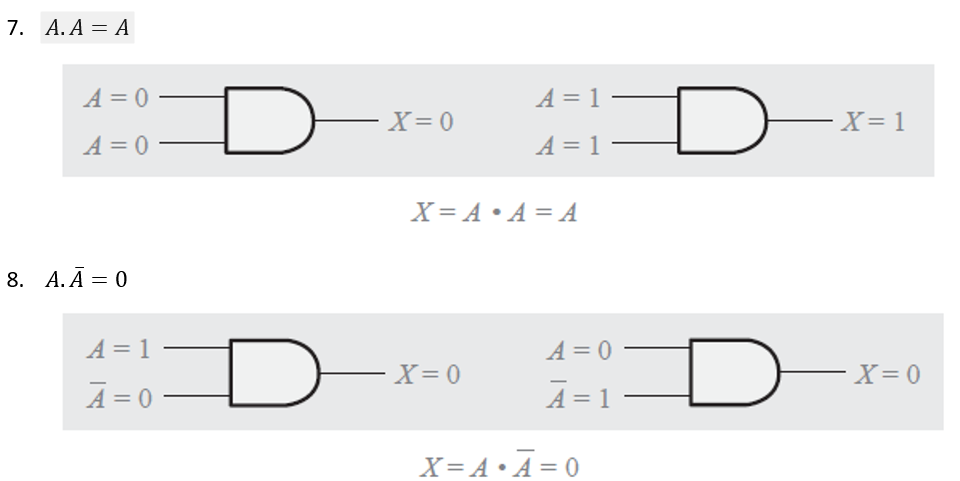
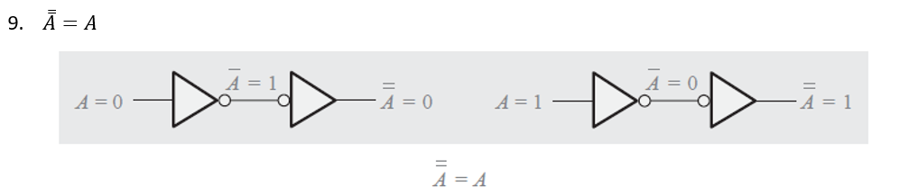
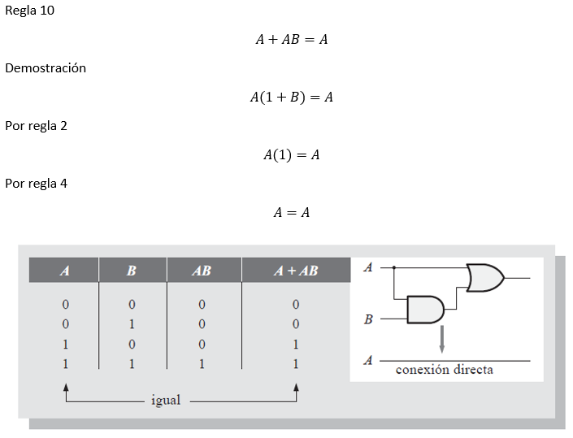
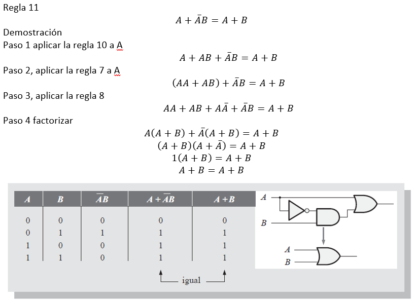
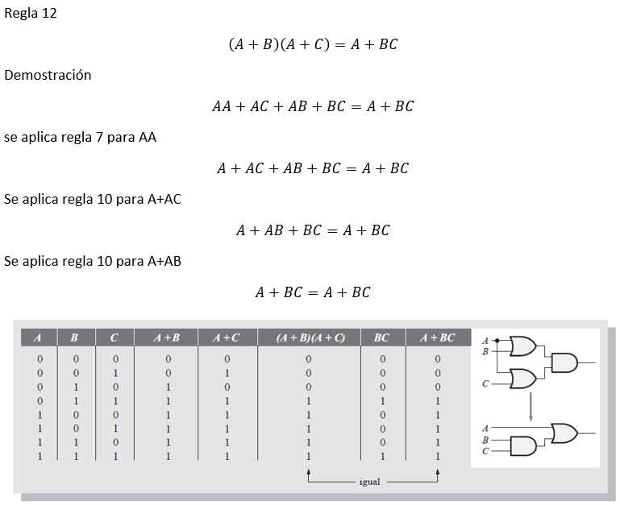
## Theorems of DeMorgan
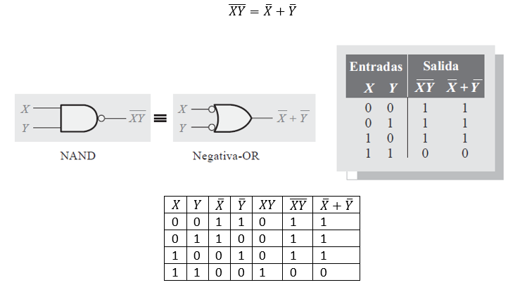
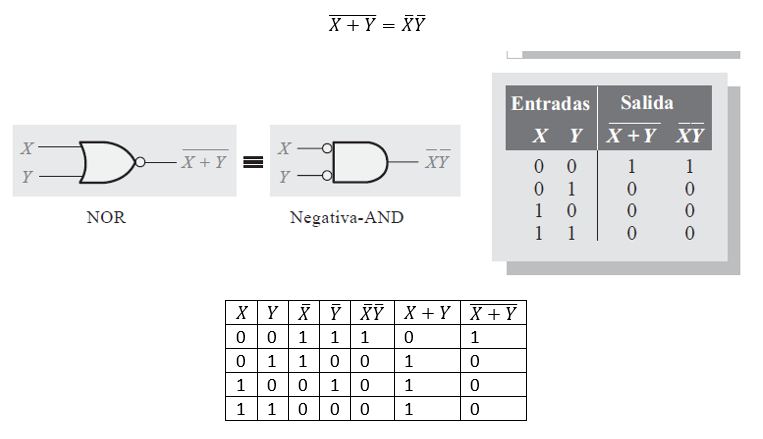
