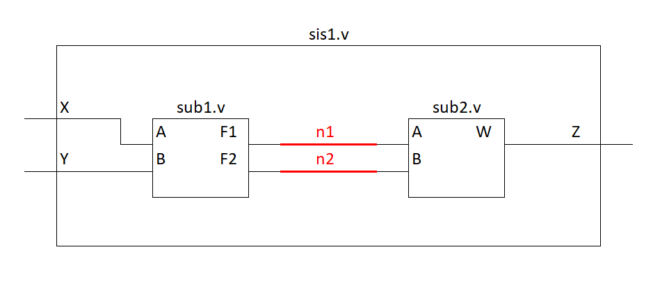

# Diseño estructural y jerarquía 

El diseño Estructural en Verilog hace referencia a la construcción de entidades o módulos a partir de subsistemas o modulos de bajo nivel, lo que se conoce como ***jerarquía***.

De esta manera, un módulo de alto nivel de diseño puramente estructural no contiene decripción de hardware, en su lugar, contiene señales y ***"llamados"*** de entidades de bajo nivel. 

## Instanciación de módulos de bajo nivel 

El termino instanciación se refuiere al uso de un esquema de bajo nivel dentro del sistema, su sintaxis es:

```verilog
nombre_modulo <identifcador_instancia>(mapeo_puertos);
```

El nombre del módulo debe ser el nombre del archivo Verilog que contiene el esquema de bajo nivel.

El identificador de instancia es un nombre opcional que se le da al momento de instanciar o usar el subsistema, es útil cuando en el sistema se van a utilizar varias instancias del mismo módulo. 

En el mapeo de puertos se especifica como se conectaran los puertos del subsistema con las señales o puertos del sistema. 

## Mapeo de puertos 
En el mapeo, de puertos los nombres de lo puertos del subsistema se escriben o referencia junto a las señales a las cuales van a estar conectados. El nombre de los puertos del subsistema va antecedido de un punto ***"."*** y la señal a la cual estará conectado va entre parentesis. Su sintaxis es:

```verilog
nombre_modulo <indeficador_modulo> (.puerto1(señal1), .puerto2(señal2), ... .puertoN(señalN));
```
Ejemplo:



```verilog
module sub1(
    input   wire    A,B,
    output  wire    F1,F2
);
//Descripción comportamental
endmodule 
```
```verilog
module sub2(
    input   wire    A,B,
    output  wire    W
);
//Descripción comportamental
endmodule 
```
```verilog
module sis1(
    input   wire    X,Y,
    output  wire    Z
);
wire    n1,n2;
sub1 U0(.A(X), .B(Y), .F1(n1), .F2(n2));
sub2 U1(.A(n1), .B(n2), .W(Z));
endmodule 
```
## Primitivas a nivel de compuertas
Verilog provee la habilidad para modelar elementos lógicos básicos a través del uso de ***Primitivas***, entre ellas tenemos **not()**, **and()**, **nand()**, **or()**, **nor()**, **xor()**, **xnor()**. Cada uno de estos elementos lógicos se instancian como subsistemas. su sintaxis es:

```verilog
nombre_primitiva <identificador_primitiva>(output, input1, input2, ... inputN);
```

Ejemplo:

En la clase de operadores en Verilog "[link a la clase](https://github.com/Darvock2640/ArquitecturaProcesadores/blob/master/PrimerCorte/OperadoresVerilog/Operadores%20en%20Verilog.md)" se realizó un ejemplo de un diselño digital combinacional (el ejemplo se encuentra al final del documento), en este caso, se realizara el mismo ejemplo  utilizando primitivas. 

```verilog
module test(
	input	wire	A,B,C,
	output	wire	F
);

	// Señales
	wire An, Bn, Cn;
	wire m0, m1, m2;

	not U0(An,A);
	not U1(Bn,B);
	not U2(Cn,C);

	and U3(m0, An, Bn, Cn);
	and U4(m1, An, B, Cn);
	and U5(m2, A, B, Cn);

	or  u6(F, m0, m1, m2); 

endmodule 
```
## Primitivas definidas de usuario 

Las primitivas definidas de usuario es un subsistema que describe su comportamiento a partir dela tabla de verdad, estas primitivas son muy útiles para crear lógica combinacional que se utilizara repetidas veces en el sistema, también son útiles cuando es más conveniente hacer la descripción a través de la tabla de verdad. 

Cada primitiva definida de usuario debe estár hecha en su propio archivo verilog, su sintaxis es:

```verilog
primitive nombre_primitiva(
    output  output1, output2, ... outputN,
    input   input1, input2, .. inputN
);
    table
    //  input1 input2 inputN : output1 output2 outputN
        0       0       0    :   0       0       0;
        0       0       1    :   0       0       1;
        .
        .
        .
        1       1       1    :   1       1       1;
    endtable
endprimitive 
```
Ejemplo 

```verilog
//
primitive test_table (
	output	F,
	input		A,B,C
);
	table 
	    //  A B C : F
	    	0 0 0 : 1;
		0 0 1 : 0;
		0 1 0 : 1;
		0 1 1 : 0;
		1 0 0 : 0;
		1 0 1 : 0;
		1 1 0 : 1;
		1 1 1 : 0;
	endtable 
endprimitive 
```
```verilog
module test(
	input	wire	A,B,C,
	output	reg	F
);

test_table U0(.A(A), .B(B), .C(C), .F(F));

endmodule 
```
