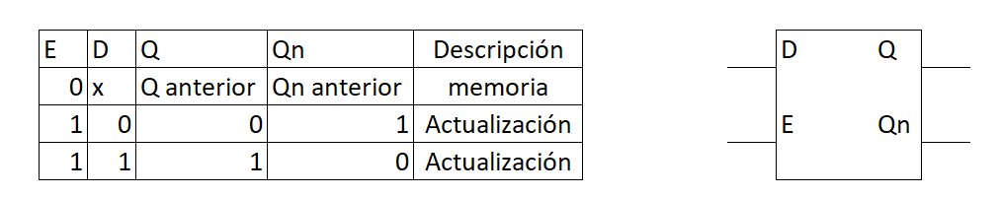
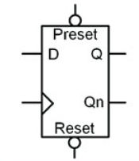
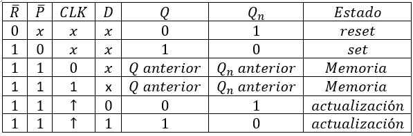
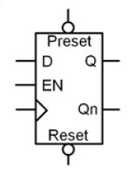
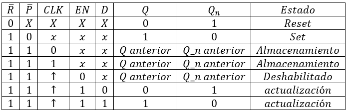
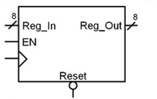
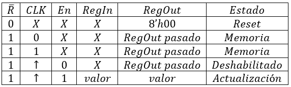

# Modelamiento secuencial de almacenamiento y registros

## Modelamiento de dispositivos de almacenamiento escalar 

### Latch tipo D
Debido a que la asignación o actualización del valor de un dispositivo de almacenamiento no es continua, este modelamiento se realizará a traves de bloques procedimentales. 



```verilog
// modulo
module LatchD(
	input	wire 	D, E,
	output	reg		Q, Qn
);

	always @(D, E)
		if (E==1'b1)
			begin
				Q  <=  D;
				Qn <= ~D;
			end
endmodule 
```
### Flip-flop tipo D
La diferencia con el Latch es que en la lista sensitiva unicamente está la señal de reloj con detección de flanco de ascenso ya que es la única forma de disparar la actualización del dato.
```verilog
// modulo FlipflopD
module FlipFlopD(
	input		wire 	D, CLK,
	output	reg	Q, Qn
);

	always @(posedge CLK)
		begin
			Q  <=  D;
			Qn <= ~D;
		end
endmodule 
```
```verilog
// TestBench
`timescale 1ns/10ps

module FlipFlopD_TB;
	reg	E,D;
	wire	Q,Qn;
	
	FlipFlopD DUT(.D(D), .CLK(E), .Q(Q), . Qn(Qn));
	
	initial
		begin
					E=0; D=0;
			#13;
					D=1;
			#2;
					D=0;
			#2;
					D=1;
			#2;
					D=0;
			#2;
					D=1;
			#2;	
					D=0;
			#2;
					D=1;
			#2;
					D=0;
			#2;
					D=1;
			#2;
					D=0;
			#2;
					D=1;
			#2;	
					D=0;
			#2
					D=1;
			#2;
					D=0;
			#2;
					D=1;
			#2;
					D=0;
			#2;
					D=1;
			#2;	
					D=0;
			#2;
					D=1;
			#2;
					D=0;
			#2;
					D=1;
			#2;
					D=0;
			#2;
					D=1;
			#2;	
					D=0;
			#5;
			
			$stop;
			$finish;		
				
		end
	always
		begin
			#10 E = ~E;
		end
	
endmodule 
```

### Entradas asíncronas
Las entradas asíncronas dentro de los dispositivos escalares de almacenamiento permiten asignar un estado definido al dispositivo sin depender de un flanco o señal de reloj. Estas entradas son:

* Preset: asigna un estado de 1 a la salida Q del dispositivo.
* Reset: asigna un 0 a la salida Q del dispositivo. 

Ejemplo: Flip - flop tipo d con Preset y Reset 





```verilog
// FlipFlopDRP

module FlipFlopDRP(
	input		wire	R, P, CLK, D,
	output 	reg	Q, Qn
);

always @(posedge CLK, negedge R, negedge P)
	begin
		if(R==1'b0)
			begin
				Q  <= 1'b0;
				Qn <= 1'b1;
			end
		else if(P==1'b0)
			begin
				Q  <= 1'b1;
				Qn <= 1'b0;
			end
		else
			begin
				Q  <=  D;
				Qn <= ~D;
			end
	end
endmodule 
```
```verilog
// TestBench 

`timescale 1ns/10ps

module FlipFlopDRP_TB;
	reg	R, P, CLK, D;
	wire	Q, Qn;
	
	FlipFlopDRP DUT (.R(R), .P(P), .CLK(CLK), .D(D), . Q(Q), .Qn(Qn));
	
	initial
		begin
					R=1; P=1; CLK=0; D=0;
			#10;
					R=0;
						#10;
						D=0;
						CLK=1;
						#10;
						CLK=0;
						#10;
						D=1;
						CLK=1;
						#10;
						CLK=0;
						#10;
				R=1;
				#10;
					P=0;
						#10;
						D=0;
						CLK=1;
						#10;
						CLK=0;
						#10;
						D=1;
						CLK=1;
						#10;
						CLK=0;
						#10;
				P=1;
				#10;
						#10;
						D=0;
						CLK=1;
						#10;
						CLK=0;
						#10;
						D=1;
						CLK=1;
						#10;
						CLK=0;
						#10;
						#10;
						D=0;
						CLK=1;
						#10;
						CLK=0;
						#10;
						D=1;
						CLK=1;
						#10;
						CLK=0;
						#10;					
		end	
endmodule 
```
### Enable 
Es una entrada síncrona que habilita o deshabilita la función del flipflop, es decir, si el enable está en alto el flipflop funciona, si el enable está en bajo el flipflop omitirá o ignorará el flanco del reloj. 

Ejemplo: FlipFlop data con reset, preset y enable.





```verilog
// FlipFlopDEn

module FlipFlopDEn(
	input		wire	R, P, CLK, D, E,
	output 	reg	Q, Qn
);

always @(posedge CLK, negedge R, negedge P)
	begin
		if(R==1'b0)
			begin
				Q  <= 1'b0;
				Qn <= 1'b1;
			end
		else if(P==1'b0)
			begin
				Q  <= 1'b1;
				Qn <= 1'b0;
			end
		else
			if(E == 1'b1)
				begin
					Q  <=  D;
					Qn <= ~D;
				end
	end
endmodule
```
```verilog
// TestBench 

`timescale 1ns/10ps

module FlipFlopDEn_TB;
	reg	R, P, CLK, D, E;
	wire	Q, Qn;
	
	FlipFlopDEn DUT (.R(R), .P(P), .CLK(CLK), .D(D), .E(E), . Q(Q), .Qn(Qn));
	
	initial
		begin
					R=1; P=1; CLK=0; D=0; E=1;
			#10;
					R=0;
						#10;
						D=0;
						CLK=1;
						#10;
						CLK=0;
						#10;
						D=1;
						CLK=1;
						#10;
						CLK=0;
						#10;
				R=1;
				#10;
					P=0;
						#10;
						D=0;
						CLK=1;
						#10;
						CLK=0;
						#10;
						D=1;
						CLK=1;
						#10;
						CLK=0;
						#10;
				P=1;
				#10;
					E=0;
						#10;
						D=0;
						CLK=1;
						#10;
						CLK=0;
						#10;
						D=1;
						CLK=1;
						#10;
						CLK=0;
						#10;
				
				E=1;
				#10;
						#10;
						D=0;
						CLK=1;
						#10;
						CLK=0;
						#10;
						D=1;
						CLK=1;
						#10;
						CLK=0;
						#10;
						#10;
						D=0;
						CLK=1;
						#10;
						CLK=0;
						#10;
						D=1;
						CLK=1;
						#10;
						CLK=0;
						#10;					
		end	
endmodule 
```
## Modelamiento de registros 
Un registro hace referencia a una agrupacion de bits de acuerdo con la arquitectura del sistema, es decir, si el sistema es un procesador de 8 bits, un registro es una agrupación de 8 bits. 

En esencia un registro se comporta exactamente igual que un flipflop tipo data, su única diferencia es que la entrada de dato ya no es un bit si no que es un vector de bits. 

Este vector de bits de entrada genera un arreglo de flipflops de la misma cantidad del vector donde todas las entradas asíncronas, el reloj y la entrada habilitadora de cada flipflop se conecta a la misma señal.

Un registro es una abstracción de alto nivel hecho de flipflops. Permite crear almacenamiento de vectores sin necesidad de entrar en detalle de los elementos de bajo nivel. A esta metodología de diseño se le conoce como ***"RTL" (Register Transfer Level)***

Ejemplo: modelo RTL de un registro de 8 bits. 





```verilog
// Register8bits 

module Register8bits (
	input 	wire	R, CLK, E,
	input 	wire	[7:0]RegIn,
	output 	reg	[7:0]RegOut 
);

	always @(posedge CLK, negedge R)
		begin : Register
			if(R == 1'b0)
				RegOut <= 8'h00;
			else
				if(E == 1'b1)
					RegOut <= RegIn;
		end
endmodule 
```