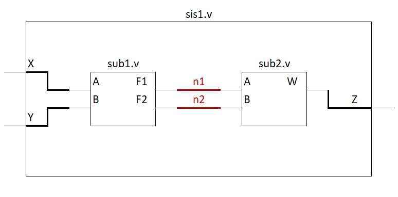

# Diseño estructural y jerarquía 
El diseño estructural en Verilog hace referencia a la construcción de entidades o modulos a partír de subsistemas o modulos de bajo nivel lo que se conoce como jerarquía. 

De esta manera cuando se habla de diseño puramente estructural, un módulo de alto nivel no debe contener descripciones de hardware, en su lugar se encuentran ***"llamados"*** de los subsistemas y las señales que los interconectan.  

## Instanciación de módulos de bajo nivel 

El termino instanciación hace referencia al uso de una entidad de bajo nivel dentro de un sistema, su sintaxis es:

```verilog
nombre_modulo <identificador_instancia> (mapeo_puertos);
```

El nombre del módulo debe ser el nombre del archivo Verilog que contiene la descripción del subsistema. 

El identificador de instancia es un nombre opcional que se da al momento de instanciar un subsistema, es útil cuando en un mismo sistema se van a utilizar varias instancias del mismo subsistema. 

En el mapeo de puertos se espcifíca como se conectaran los puertos del subsistema con las señales o puertos del sistema de alto nivel. 

## Mapeo de puertos 
En el mapeo de puertos los nombres de los puertos del subsistema se escriben o se referencian junto a las señales a las cuales estaran conectadas. Los nombre de los puertos del subsitema van antecedidos de un punto ***"."*** y las señales a la cuales estaran conectadas van entre parentesis. Su sintaxis es:
```verilog
nombre_modulo <identificador_instancia> (.puerto1(señal1), .puerto2(señal2), ... .puertoN(señalN));
``` 
Ejemplo



```verilog
module sub1(
    input   wire    A,B,
    output  wire    F1,F2
);
//Aquí va al descripción
endmodule 
```
```verilog
module sub2(
    input   wire    A,B,
    output  wire    W
);
//Aquí va al descripción
endmodule 
```
```verilog
module sis1(
    input   wire    X,Y,
    output  wire    Z
);

wire    n1, n2;

sub1 U0(.A(X), .B(Y), .F1(n1), .F2(n2));

sub2 U1(.A(n1), .B(n2), .W(Z));

endmodule
```
## Primitivas a nivel de compuertas
Verilog provee la habilidad para modelar elementos lógicos básicos a través del uso de ***Primitivas***, entre ellas tenemos **not()** **and()** **nand()** **or()** **nor()** **xor()** **xnor()**. Cada uno de estos elmento lógicos se instancian como subsistemas. su sintaxis es:

```verilog
nombre_primitva <identificador_primitiva> (output, input1, input2, ... inputN);
```

Ejemplo:

En la [Clase de operadores en verilog](https://github.com/Darvock2640/ArquitecturaProcesadores/blob/master/PrimerCorte/OperadoresVerilog/Operadores%20en%20Verilog.md) se realizó un ejemplo de un diseño digital combinacional (está al final del documento). En este caso, se realizará el mismo ejemplo utilizando primitiva a nivel de compuertas. 

```verilog
//módulo
module test(
	input	wire	A, B, C,
	output	wire	F
);

	wire	An, Bn, Cn;
	wire	m0, m1, m2;
	
	not U0(An, A);
	not U1(Bn, B);
	not U2(Cn, C);
	
	and U3(m0, An, Bn, Cn);
	and U4(m1, An, B, Cn);
	and U5(m2, A, B, Cn);
	
	or  U6(F, m0, m1, m2);
endmodule 
```
```verilog
//testbench
`timescale 1ns/10ps

module test_TB;

	reg 	in1, in2, in3;
	wire	out;
	
	test DUT(.A(in1), .B(in2), .C(in3), .F(out));
	
	initial
		begin
				in1=0; in2=0; in3=0;
			#20	in1=0; in2=0; in3=1;
			#20	in1=0; in2=1; in3=0;
			#20	in1=0; in2=1; in3=1;
			#20	in1=1; in2=0; in3=0;
			#20	in1=1; in2=0; in3=1;
			#20	in1=1; in2=1; in3=0;
			#20	in1=1; in2=1; in3=1;
			#20;
	end
endmodule 
```
## Primitivas definidas de usuario 
Las primitivas definidas de usuario son subsistemas que describen su comportamiento a partir de la tabla de verdad, estas primitivas son útiles para crear lógica combinacional que se utilizara repetidas veces en el sistema, también son útiles cuando es más conveniente hacer la descripción a través de la tabla de verdad. Cada primitiva de usuario debe estár hecha en su propio archivo verilog. su sintaxis es:

```verilog
primitive nombre_primitiva(
    output  out1,
    input   in1, in2, ... inN 
);
    table
        // in1 in2 inN : out1;
            0   0   0  :  0;
            0   0   1  :  0;
            .
            .
            .
            1   1   1 :   1;
    endtable
endprimitive 
```
Ejemplo

```verilog
//primitiva de usuario
primitive test_table(
	output	F,
	input		A, B, C
);

	table
		// A B C : F
		   0 0 0 : 1;
			0 0 1 : 0;
			0 1 0 : 1;
			0 1 1 : 0;
			1 0 0 : 0;
			1 0 1 : 0;
			1 1 0 : 1;
			1 1 1 : 0;
	endtable

endprimitive 
```
```verilog
//entidad de alto nivel 
module test(
	input		wire	A, B, C,
	output	wire	F
);

	test_table(.F(F), .A(A), .B(B), .C(C));

endmodule 
```
