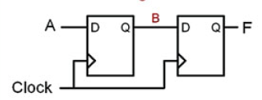
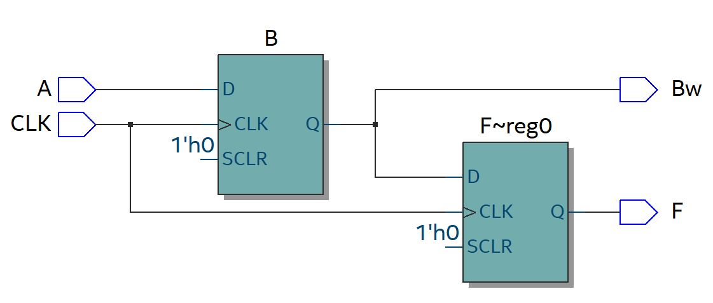
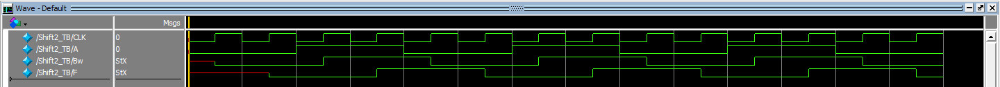
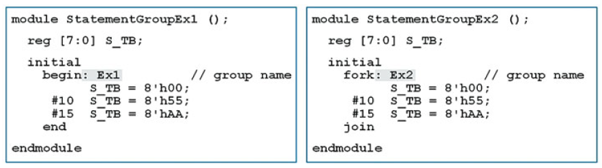
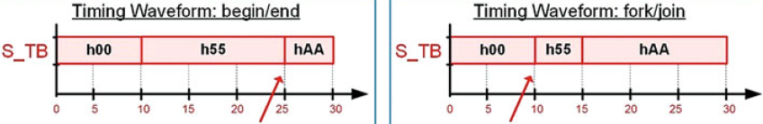

# Modelamiento Procedimental 
La electrónica digital se divide en dos grandes grupos:
* Lógica combinacional:

    Se realizan soluciones digitales a partir de arreglos de compuertas lógicas donde las salidas del circuito dependen únicamente de sus entradas.

    En verilog los circuitos lógicos combinacionales se describen a partir de modelamiento concurrente. 

* Lógica secuencial:
    
    Se realizan soluciones digitales a partir de elementos que pueden almacenar información, además, en la mayoría de casos se utilizan señales de reloj. 

    Estos circuitos de forma fundamental están hechos a partir de compuertas lógicas pero se diferencian de la lógica combinacional por que sus salidas están retroalimentadas a las entradas. 

    En verilog los circuitos lógicos secuenciales se describen a partir de modelamiento procedimental. 

En este orden de ideas, el modelamiento procedimental hace referencia a descripciones que pueden activarse ***(Triggered)*** a través del cambio de estado, flanco de ascenso o descenso de un puerto o de una señal en especifico. Esto nos permite realizar descripciones de elementos secuenciales como flip-flop's, Latch., registros, etc ...

En el modelamiento procedimental las asignaciones solo pueden realizarce en tipos de datos de variables (reg, integer, real, time, realtime).

## Bloques procedimentales 

En el modelamiento procedimental todas las asignaciones deben estar encapsuladas dentro de bloques procedimentales. 

### Initial block 
En el ***initial block*** se ejecutaran todas las lineas al inicio de la simulación. Este bloque no permite realizar descripciones sintetizables. Su sintaxis es:

```verilog
initial
    begin   
        //Aquí van las asignaciones
end
```
### Always block
El bloque ***Always*** se ejecutara simpre. Si se utiliza en simulación se ejecutara mientras la simulación esté activa. Su sintaxis es:

```verilog
always
    begin
        //aquí van las asignaciones
end
```

Ejemplo

```verilog
always
    begin
        #10;
        clock = ~clock;
end
```

El ejemplo anterior no funciona por si mismo ya que la señal no contiene una condicion inicial. Para que este ejemplo sea funcional se necesita un bloque ***initial*** que asigne el valor inicial de la señal. 

```verilog

`timescale 1ns/10ps

module test_TB;

	reg	clock;
	
	initial
		begin
			clock = 1;
	end
	
	always
		begin
			#10;
			clock = ~clock;
	end

endmodule 
```

### Listas sensitivas
Las listas sensitivas son usadas en conjunto con los bloques procedimentales para ejecutar ***(triggered)*** sus asignaciones, es decir, únicamente se ejecutaran las asignaciones del bloque cuando alguna de las señales enumeradas en la lista sensitiva cambie. Su sintaxis es:

```verilog 
always @(señal1, señal2, ... señalN)
    begin
        //Aquí van las asignaciones
end
```
Ejemplo 

```verilog
// modulo
module test(
	input		wire	A, B, C,
	output	reg	F
);
	always @(A, B, C)
		begin
			F = A & B & C;
	end

endmodule 
```
```verilog
// testbench

`timescale 1ns/10ps

module test_TB;

	reg 	in1, in2, in3;
	wire	out;
	
	test DUT(.A(in1), .B(in2), .C(in3), .F(out));
	
	initial
		begin
					in1=0; in2=0; in3=0;
			#20	in1=0; in2=0; in3=1;
			#20	in1=0; in2=1; in3=0;
			#20	in1=0; in2=1; in3=1;
			#20	in1=1; in2=0; in3=0;
			#20	in1=1; in2=0; in3=1;
			#20	in1=1; in2=1; in3=0;
			#20	in1=1; in2=1; in3=1;
			#20;
	end

endmodule 
```
Las listas sensitivas tienen palabras reservadas que especifícan la naturaleza de la señal o cual es el cambio que debe tener la señal para activar el bloque. Estas son ***negedge*** ***posedge***.

Ejemplo

Flip - flop tipo D sin las entradas asincronas (set - reset)
```verilog
module test(
	input	wire	D, clock,
	output	reg	Q
);

always @(posedge clock)
	begin
		Q = D;
end

endmodule 
```
### Declaraciones procedimentales 
Existen dos tipos de declariones procedimentales:
#### Asignaciones bloqueantes 
Las asignaciones bloqueantes son denotadas por el símbolo ***"="*** y la asignación de cada declaracion tiene lugar inmediatamente. 

Cada asignación dentro del bloque procedimental es realizada en paralelo. 

La razón para diseñar lógica combinacional usando bloques procedimentales en lugar de asignaciones continuas es que dentro de los bloques procedimentales existen estructuras de control más avanzadas. 

Con las asignaciones bloqueantes se construye lógica combinacional dentro de bloques procedimentales.

#### Asignaciones no bloqueantes 
Las asignaciones no bloqueantes se representan con el símbolo ***"<="***. Cuando se usan asingnaciones no bloqueantes, la asignación al objetivo se difiere al final del bloque procedimental. Esto significa que las asignaciones no bloqueantes **No se realizan en paralelo** si no de forma secuencial en el orden en el que están escritas.

Cuando se realizan asignaciones no bloqueantes en conjunto con ***Triggering*** se puede sintetizar circuitos secuenciales. 

Ejemplo:



```verilog
// modulo
module Shift2(
	input		wire 	CLK, A,
	output	reg 	F,
	output	wire	Bw
);

	reg B;
	
	assign Bw = B;

	always @(posedge CLK)
		begin
			B <= A;
			F <= B;
		end

endmodule 
```
```verilog
//test bench
`timescale 10ns/1ps

module Shift2_TB;
	reg 	CLK, A;
	wire  F, Bw;	
	
	Shift2 DUT(.A(A), .CLK(CLK), .F(F), .Bw(Bw));
	
	initial
		begin
					A=0; CLK=0;
			#20 	A=1;
			#20 	A=0;
			#20 	A=1;
			#20 	A=0;
			#20 	A=1;
			#20 	A=0;
			#20;
			$stop;
			$finish;
		end
	always
		begin
			#5; CLK=~CLK;
		end
		
endmodule 
```




### Grupos de declaraciones 
Los grupos de declaraciones se refieren a como son procesadas las declaraciones que están especificadas dentro del grupo. 

Básicamente existen  dos grupos de declaraciones ***begin/end*** y ***fork/join***.

Cuando se usa el grupo ***begin/end*** las declaraciones se ejecutan una tras de otra en el orden en el que están escritas.

Cuando se utiliza el grupo ***fork/join*** las declaraciones dentro del grupo se ejecutan en paralelo. 




Sí en los bloques procedimentales hay más de una declaracion es obligatorio el uso de grupos de declaraciones. 

### Variables locales 
Las variables pueden ser declaradas dentro de un bloque procedimental, para que esto ocurra, el grupo de declaraciones debe tener un nombre. 

Las variables unicamente son visibles dentro del bloque y unicamente pueden ser del tipo ***variable***

```verilog
initial
	begin: sim_block
		integer i;		//Variable del timpo entero 32 bits
		i=2;			//asignación del valor 2 a la variable i
	end
```
## Construcciones de programación condicional 
Una de las características más poderosas de los bloques procedimentales es el uso de constructores de programación condicional tales como: 
* if-else
* case
* loops

Estos construtores solo se pueden utilizar dentro de los bloques procedimentales y permiten modelar tanto lógica combinacional como secuencial. 
### if - else
El constructor if - else provee una forma de realizar asignaciones a partir de una condicion booleana, si al evaluar la condición esta tiene como resultado un **True** se ejecutaran las declaraciones que estén dentro del if. Por el contrario, se ejecutaran las declaraciones dentro del else. 

Su sintaxis es: 
```verilog
if (<condición>)
	begin
		declaración_TRUE_1
		declaración_TRUE_2
		.
		.
		.
		declaración_TRUE_N
	end
else
	begin
		declaración_FALSE_1
		declaración_FALSE_2
		.
		.
		.
		declaración_FALSE_N
	end
```
Si se necesita evaluar más de una condición booleana se utiliza el constructor ***else if***

Su sintaxis es:
```verilog
if (<condición_1>)
	begin
		declaración_TRUE_1
		declaración_TRUE_2
		.
		.
		.
		declaración_TRUE_N
	end
else if (<condición_2>)
	begin
		declaración_TRUE_1
		declaración_TRUE_2
		.
		.
		.
		declaración_TRUE_N
	end
.
.
.
else if (<condición_N>)
	begin
		declaración_TRUE_1
		declaración_TRUE_2
		.
		.
		.
		declaración_TRUE_N
	end
else
	begin
		declaración_FALSE_1
		declaración_FALSE_2
		.
		.
		.
		declaración_FALSE_N
	end
```
Ejemplo:

Se realizara el ejemplo de lógica combinacinal del final del tema de [operadores en verilog](https://github.com/Darvock2640/ArquitecturaProcesadores/blob/master/Primer_corte/Operadores_Verilog/Operadores%20en%20Verilog.md)

```verilog
// modulo
module IfTest(
	input		wire	A, B, C,
	output	reg	F
);

	always@(A,B,C)
		begin
			if (A==0 && B==0 && C==0)
				F = 1;
			else if (A==0 && B==1 && C==0)
				F = 1;
			else if (A==1 && B==1 && C==0)
				F = 1;
			else
				F = 0;
		end

endmodule 
```
### case
El constructor ***case***  es otra tecnica de modelamiento a partir de condicionaes booleanas, este solo puede existir dentro de un bloque procedimental y utiliza las palabras reservadas ***case**, ***default***, ***endcase***.

Su sintaxis es: 
```verilog
case (<condición>)
	valor_condición_1 : declaración_1
	valor_condición_2 : declaración_2
	.
	.
	.
	valor_condición_n : declaración_n
	default : declaración_default
endcase
```
Ejemplo:

Se realizara el ejemplo de lógica combinacinal del final del tema de [operadores en verilog](https://github.com/Darvock2640/ArquitecturaProcesadores/blob/master/Primer_corte/Operadores_Verilog/Operadores%20en%20Verilog.md)

```verilog
// aprox 1
module test(
	input 	wire	A,B,C,
	output	reg	F
);
	always@(A,B,C)
		begin
			case ({A,B,C})
				3'b000 : F = 1;
				3'b001 : F = 0;
				3'b010 : F = 1;
				3'b011 : F = 0;
				3'b100 : F = 0;
				3'b101 : F = 0;
				3'b110 : F = 1;
				3'b111 : F = 0;
				default : F = 0;			
			endcase
		end

endmodule 
```
```verilog
// aprox 2
module test(
	input 	wire	A,B,C,
	output	reg	F
);
	always@(A,B,C)
		begin
			case ({A,B,C})
				3'b000 : F = 1;
				3'b010 : F = 1;
				3'b110 : F = 1;
				default : F = 0;			
			endcase
		end

endmodule 
```
```verilog
// aprox 3
module test(
	input 	wire	A,B,C,
	output	reg	F
);
	always@(A,B,C)
		begin
			case ({A,B,C})
				3'b000, 3'b010, 3'b110 : F = 1'b1;
				default 					  : F = 1'b0;			
			endcase
		end
endmodule 
```

### Bucle ***forever***
Este mecanismo permite realizar asignaciones por siempre, este se utiliza en los test benchs para realizar simulaciones de señales de reloj.
```verilog
initial
	begin
		CLK=0;

		forever
			#10 CLK=~CLK;
	end
```
### Bucle ***while***
Este bucle provee una estructura de repetición controlada a través de una codición booleana, su sintaxis es: 
```verilog
while (<condición>)
	begin
		declaración1;
		declaración2;
		.
		.
		.
		declaraciónN;
	end
```
Ejemplo: Reloj con enable
```verilog
initial
	begin
		CLK=0;
		while(EN==1)
			#10 CLK=~CLK;
	end
```
### Bucle ***repeat***
Este bucle permite repetir la ejecución un número fijo de veces. su sintaxis es: 
```verilog
repeat(<número_repeticiones>)
	begin
		declaración_1;
		declaración_2;
		.
		.
		.
		declaración_N;
	end
```
Ejemplo: Reloj con 10 ciclos
```verilog
initial
	begin
		CLK=0;
		repeat(10)
			#10 CLK=~CLK;
	end
```
### Bucle ***for***
El bucle ***for*** permnite controlar las veces de la repetición a partir de una asignación inicial, una condición booleana y una asignación de paso. Su sintaxis es:
```verilog
for(<asignación_inicial>; <condición_booleana>; <asignación_paso>)
	begin
		declaración_1;
		declaración_2;
		.
		.
		.
		declaración_N;
	end
```
Ejemplo
```verilog
initial
	begin
		for(i=0; i<15; i=i+1)
			#10	Count=i;
	end
```
### disable
Verilog provee la hablidad de para o finalizar un bucle a tracvés de la palabra reservada ***disable***. La función ***disable*** unicamente funciona dentro de grupos de declaraciones que han sido nombrado s.

Ejemplo: reloj con enable
```verilog
initial
	begin
		CLK=0;
		forever
			begin: loop
				if(EN==1)
					#10 CLK=~CLK;
				else
					disable loop;

			end
	end
```
