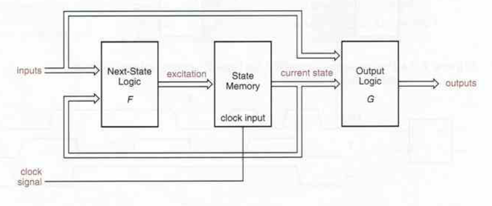
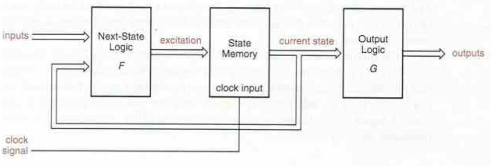

# Máquinas de estados finitos 
El nombre formal y completo de estos dispositvos es ***"clocked synchronous state machine"***.

El termino máquina de estados es un nombre genérico que se le da a circuitos secuenciales retroalimentados. La palabra ***"clocked"*** significa que son dispositivos que funcionan a partir de una señal de reloj, por lo cual poseen elementos de almacenamiento de información, y ***"Synchronous"*** significa que todos los flip - flop's están conectados a la misma señal de reloj. 

## Estructura de una máquina de estados 
 

En esencia, una máquina de estados tiene tres bloques principales que son:
* Siguiente estado: Es un bloque de lógica combinacional donde a partír del estado actual y las entradas del sistema se determina cual será el siguiente estado. Por lo tanto este bloque se puede definir como una función lógica que depende de las entradas y del estado actual ***F(entradas, estado actual)***
* Memoria: Este bloque almacena el estado actual del sistema, es decir, los valores actuales que tienen las variables de estado y está compuesto generalmente de flop - flop's tipo D. 
* Lógica de salida 
Es un bloque de lógica combinacional donde a partír del estado actual se determinan las salidas del sistema. Este bloque puede definirse de dos maneras:
    - Una función lógica que depende de las entradas y el estado actual ***G(entradas, estado actual)***. Este tipo de máquinas de estado recibe el nombre de ***"Mealy machine"***.
    - Una función lógica que depende únicamente del estado actual ***G(estdao actual)***. a este tipo de máquinas de estado se les conoce como ***"Moore machine"***.

    

Una FSM (Finite state machine) es uno de los circuitos digitales más poderosos que existen ya que estas pueden tomar decisiones acerca de la proxima salida basadas en su estado actual y sus entradas. 

## Implementación de máquinas de estados 

Se necesita abrir o cerar una ventana a partír de un solo botón, el sistema posee sensores de apertura, cierre y un motor que da el movimiento al sistema. 

Solución:

### Diagrama de bloques 


### Diagrama de estados 


### Implementación de máquinas de estados en Verilog 

La práctica más común a la hora de implementar FSM en Verilog es declarar dos señales del tipo ***reg*** que se llamarán ***"next_state"*** ***"current_state"***, además, se definen los parametros con el nombre descriptivo del estado y su respectivo valor.

```verilog
reg	next_state, current_state;
	
parameter w_closed = 1'b0;
          w_opened = 1'b1;
```
Debido  a que las máquinas de estados tienen tres bloques definidos, estos tres bloque se van a modelar a partir de tres bloques procedimentales que se llamaran ***next_state_logic***, ***state_memory***, ***output_logic***.

```verilog
// FSM

module FSM(

);

	reg	next_state, current_state;
	
	parameter w_closed = 1'b0;
			  w_opened = 1'b1;
				 
	always @()
		begin: state_memory
		
		end
		
	always @()
		begin: next_logic_state
		
		end
		
	always @()
		begin: output_logic
		
		end

endmodule 
```
#### State_Memory
En el bloque de memoria tenemos logica secuencial, por lo tanto en la lista sensitiva se debe colocar el reloj y el reset con su respectivo flanco, además este bloque se encarga de almacenar el estado actual y actualizar al estado siguiente a partir de la señal de reloj.  

```verilog
always @(posedge CLK, negedge R)
    begin: state_memory
        if (R == 0)
            current_state <= w_closed;
        else
            current_state <= next_state;
    end
```
#### next_logic_state
Este es un bloque de lógica combinacional, esto significa que en la lista sensitiva deben estar todas las señales que pueden ocacionar un cambio en la salida. 

Como esta logica combinacional depende de el estado actual de la máquina, generalmente se modela con un case donde cada caso es uno de los posibles estados.

```verilog
always @(current_state, o_s, c_s)
    begin: next_logic_state
        case (current_state)
            w_closed:
                if(o_s == 1)
                    next_state = w_opened;
                else
                    next_state = w_closed;
            w_opened:
                if(c_s == 1)
                    next_state = w_closed;
                else
                    next_state = w_opened;				
        endcase 		
    end
```
#### Output_Logic
Este es un bloque de lógica combinacional, por lo tanto, las señales de la lista sensitiva deben ser aquellas que representan un cambio en la salida.

Nuevamente, como la lógica de salida del sistema depende del estado actual, este bloque también se modela con un case. 

```verilog
always @(current_state, press)
    begin: output_logic
        case (current_state)
            w_closed:
                if(press == 1)
                    begin
                        M1 = 1;
                        M2 = 0;
                    end
                else
                    begin
                        M1 = 0;
                        M2 = 0;
                    end					
            w_opened:
                if(press == 1)
                    begin
                        M1 = 0;
                        M2 = 1;
                    end
                else
                    begin
                        M1 = 0;
                        M2 = 0;
                    end
            default: 
                begin
                    M1 = 0;
                    M2 = 0;
                end				
        endcase		
    end
```
solución total

```verilog
// FSM

module FSM(
	input		wire	press, CLK, R, o_s, c_s,
	output	reg	M1, M2,
	output	wire	state
);

	reg	next_state, current_state;
	
	parameter w_closed = 1'b0,
				 w_opened = 1'b1;
				 
	assign state = current_state;
				 
	always @(posedge CLK, negedge R)
		begin: state_memory
			if (R == 0)
				current_state <= w_closed;
			else
				current_state <= next_state;
		end
		
	always @(current_state, o_s, c_s)
		begin: next_logic_state
			case (current_state)
				w_closed:
					if(o_s == 1)
						next_state = w_opened;
					else
						next_state = w_closed;
				w_opened:
					if(c_s == 1)
						next_state = w_closed;
					else
						next_state = w_opened;				
			endcase 		
		end
		
	always @(current_state, press)
		begin: output_logic
			case (current_state)
				w_closed:
					if(press == 1)
						begin
							M1 = 1;
							M2 = 0;
						end
					else
						begin
							M1 = 0;
							M2 = 0;
						end					
				w_opened:
					if(press == 1)
						begin
							M1 = 0;
							M2 = 1;
						end
					else
						begin
							M1 = 0;
							M2 = 0;
						end
				default: 
					begin
						M1 = 0;
						M2 = 0;
					end				
			endcase		
		end
endmodule 
```

```verilog
// FSM test bench

`timescale 10ns/1ps

module FSM_TB;

	reg	press, CLK, R, o_s, c_s;
	wire	M1, M2, state;

	FSM DUT (.press(press), .CLK(CLK), .R(R), .o_s(o_s), .c_s(c_s), .M1(M1), .M2(M2), .state(state));
	
	initial 
		begin
			R = 0; CLK = 0; press = 0; o_s = 1; c_s = 0;
			#10	R = 1;
			#10	press = 1;
					o_s = 0;
			#10	press = 0;
			#10	press = 1;
			#10	press = 0;
					c_s = 1;
			#10;
			#10	press = 1;
					c_s = 0;
			#10	press = 0;
			#10	press = 1; 
			#10	press = 0;
					o_s = 1;
			#10;
			$stop;
		end
	
	always
		begin
			#1 CLK = ~CLK;
		end	
	
endmodule 
```
