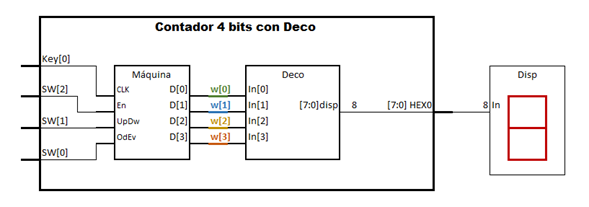
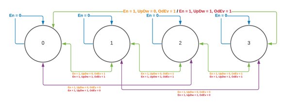

# Solución Laboratorio Máquinas de Estados

## Diagrama de bloques


## Diagrama de estados


## Decodificador
```verilog
module Deco(
	output	reg	    [7:0]disp,
	input	wire	[3:0]In
);	
	always @(In)
		begin
			case (In)
				4'h0  	:	disp = 8'b11000000; 
				4'h1  	:  disp = 8'b11111001;
				4'h2  	:	disp = 8'b10100100;
				4'h3  	:	disp = 8'b10110000;
				4'h4  	:	disp = 8'b10011001;
				4'h5  	:	disp = 8'b10010010;
				4'h6  	:	disp = 8'b10000010;
				4'h7  	:	disp = 8'b11111000;
				4'h8  	:	disp = 8'b10000000;
				4'h9  	:	disp = 8'b10010000;
				4'hA  	:	disp = 8'b10001000;
				4'hB  	:  disp = 8'b10000011;
				4'hC  	:  disp = 8'b11000110;
				4'hD  	:  disp = 8'b10100001;
				4'hE  	:  disp = 8'b10000110;
				4'hF  	:  disp = 8'b10001110;
				default 	:  disp = 255;
			endcase 
		end
endmodule
```
## Máquina de estados
```verilog
// Modulo de máquina
module Maquina (
    input   wire    CLK, En, UpDw, OdEv,
    output  reg     [3:0]D
);

    reg [3:0]next_state;
    reg [3:0]current_state;

    parameter   s0  =  0,  s1  =  1,  s2  =  2, s3  =  3, 
                s4  =  4,  s5  =  5,  s6  =  6, s7  =  7, 
                s8  =  8,  s9  =  9,  s10 = 10, s11 = 11, 
                s12 = 12,  s13 = 13,  s14 = 14, s15 = 15;

    parameter   upev = 3'b111, dwev = 3'b101, upod = 3'b110, dwod = 3'b100;

    always @(posedge CLK) 
        begin: state_memory
            current_state <= next_state;
        end

    always @(current_state, En, UpDw, OdEv) 
        begin: next_state_logic
            case (current_state)
                s0  :
                    case ({En, UpDw, OdEv})
                        upev    : next_state = s1 ;
                        dwev    : next_state = s15;
                        upod    : next_state = s2 ;
                        dwod    : next_state = s14;
                        default : next_state = current_state;
                    endcase
                s1  :
                    case ({En, UpDw, OdEv})
                        upev    : next_state = s2 ;
                        dwev    : next_state = s0 ;
                        upod    : next_state = s3 ;
                        dwod    : next_state = s15;
                        default : next_state = current_state;
                    endcase
                s2  :
                    case ({En, UpDw, OdEv})
                        upev    : next_state = s3 ;
                        dwev    : next_state = s1 ;
                        upod    : next_state = s4 ;
                        dwod    : next_state = s0 ;
                        default : next_state = current_state;
                    endcase
                s3  :
                    case ({En, UpDw, OdEv})
                        upev    : next_state = s4 ;
                        dwev    : next_state = s2 ;
                        upod    : next_state = s5 ;
                        dwod    : next_state = s1 ;
                        default : next_state = current_state;
                    endcase
                s4  :
                    case ({En, UpDw, OdEv})
                        upev    : next_state = s5 ;
                        dwev    : next_state = s3 ;
                        upod    : next_state = s6 ;
                        dwod    : next_state = s2 ;
                        default : next_state = current_state;
                    endcase
                s5  :
                    case ({En, UpDw, OdEv})
                        upev    : next_state = s6 ;
                        dwev    : next_state = s4 ;
                        upod    : next_state = s7 ;
                        dwod    : next_state = s3 ;
                        default : next_state = current_state;
                    endcase
                s6  :
                    case ({En, UpDw, OdEv})
                        upev    : next_state = s7 ;
                        dwev    : next_state = s5 ;
                        upod    : next_state = s8 ;
                        dwod    : next_state = s4 ;
                        default : next_state = current_state;
                    endcase
                s7  :
                    case ({En, UpDw, OdEv})
                        upev    : next_state = s8 ;
                        dwev    : next_state = s6 ;
                        upod    : next_state = s9 ;
                        dwod    : next_state = s5 ;
                        default : next_state = current_state;
                    endcase
                s8  :
                    case ({En, UpDw, OdEv})
                        upev    : next_state = s9 ;
                        dwev    : next_state = s7 ;
                        upod    : next_state = s10 ;
                        dwod    : next_state = s6 ;
                        default : next_state = current_state;
                    endcase
                s9  :
                    case ({En, UpDw, OdEv})
                        upev    : next_state = s10 ;
                        dwev    : next_state = s8 ;
                        upod    : next_state = s11 ;
                        dwod    : next_state = s7 ;
                        default : next_state = current_state;
                    endcase
                s10 :
                    case ({En, UpDw, OdEv})
                        upev    : next_state = s11 ;
                        dwev    : next_state = s9 ;
                        upod    : next_state = s12 ;
                        dwod    : next_state = s8 ;
                        default : next_state = current_state;
                    endcase
                s11 :
                    case ({En, UpDw, OdEv})
                        upev    : next_state = s12 ;
                        dwev    : next_state = s10 ;
                        upod    : next_state = s13 ;
                        dwod    : next_state = s9 ;
                        default : next_state = current_state;
                    endcase
                s12 :
                    case ({En, UpDw, OdEv})
                        upev    : next_state = s13 ;
                        dwev    : next_state = s11 ;
                        upod    : next_state = s14 ;
                        dwod    : next_state = s10 ;
                        default : next_state = current_state;
                    endcase
                s13 :
                    case ({En, UpDw, OdEv})
                        upev    : next_state = s14 ;
                        dwev    : next_state = s12 ;
                        upod    : next_state = s15 ;
                        dwod    : next_state = s11 ;
                        default : next_state = current_state;
                    endcase
                s14 :
                    case ({En, UpDw, OdEv})
                        upev    : next_state = s15 ;
                        dwev    : next_state = s13 ;
                        upod    : next_state = s0 ;
                        dwod    : next_state = s12 ;
                        default : next_state = current_state;
                    endcase
                s15 :
                    case ({En, UpDw, OdEv})
                        upev    : next_state = s0 ;
                        dwev    : next_state = s14 ;
                        upod    : next_state = s1 ;
                        dwod    : next_state = s13 ;
                        default : next_state = current_state;
                    endcase 
            endcase
        end

    always @(current_state) 
        begin: output_logic
            D = current_state;
        end    
endmodule
```
## Sistema total
```verilog
module ContMaq(
	//////////// SEG7 //////////
	output		     [7:0]		HEX0,
	//////////// KEY //////////
	input 		     [1:0]		KEY,
	//////////// SW //////////
	input 		     [2:0]		SW
);
wire	[3:0]w;

Maquina	    U0(.CLK(KEY[0]), .En(SW[2]), .UpDw(SW[1]), .OdEv(SW[0]), .D(w));
Deco 		U1(.In(w), .disp(HEX0));


endmodule

```