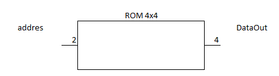

# Modelamiento de memoria 
El modelamiento de memoria en verilog se realiza en forma matricial y puede ser sintetizada en una amplia gama de dispositivos ***"Semiconductor Memory"***. 

## Arquitectura y terminología 
El termino **memoria** es usado para describir un sistema con la habilidad de almacenar información digital. 

El termino ***Semiconductor memory*** hace referencia a sistemas que están implementados usando tecnología de circuitos integrados.

Estos tipos de sistemas de almacenamiento de información digital usan transistores, fusibles, condensadores and/or en un simple sustrato semiconductor. 

La memoria basada en semiconductores es llamada ***Memoria de estado solido*** ya que no tiene partes moviles, además, puede almacenar más información por unidad de área que otras tecnologías. 

### Mapa de un modelo de memoria 
La información almacenada en memoria es llamada ***"data - dato"***. Cuando la información es ubicada en memoria se conoce como ***""write - escribir***, por el contrario, cuando la información es recibida desde la memoria, esta acción se denomina ***"read - leer"***. 

Para poder acceder a los datos almacenados en una memoria se utiliza una ***"addres - dirección"***, esta dirección apunta a un grupo de **N** bits denominado ***"word - palabra"***. Si una memoria tienen **N = 8**, esto significa que 8 bits de datos son almacenados en cada dirección. 

El número de direcciones de memoria se describe usando la variable ***"M"***, por lo tanto, el tamaño total de la memoria se define como **M x N**. 

Debido a que la dirección se implementa como un código binario, la cantidad de lineas en el bus de dirección **(n)** indicará el número de posiciones de memoria que el sistema tiene 

Ejemplo


### Memoria volatil vs no volatil 
La memoria es clasificada en dos categorias de acuerdo a si esta puede almacenar información cuando la energía es removida o no.

El término ***(non volatile - no volatil)*** es usado para describir memoria que sostiene información cuando la alimentación se remueve. Mientras que el término ***(volatile - volatil)*** es usado para describir memoria que pierde su información cuando no está energizada. 

La memoria volatil es capaz de correr a velocidades más altas comparada con una memoria no volatil, por lo tanto, esta es usada como el mecanismo primordial de almacenamiento cuando el sistema digital está corriendo. La memoria no volatil es necesaria para contener información de operaciones críticas para sistemas digitales tales como instrucciones, sistemas operativos y aplicaciones.

### Read-Only vs Read/Write Memory - memoria de solo lectura vs memoria lectura/escritura
La memoria también puede ser clasificada en dos categorías con respecto a como son accedidos los datos. La ***ROM (Read only memory - memoria de solo lectura)*** es un dispositivo que no puede ser escrito durante una operación normal. Este tipo de memoria es útil para contener información crítica del sistema o programas que no deben ser alterados mientras el sistema está en funcionamiento.

La memoria ***Read/Write*** se refiere a memoria que puede ser escrita y leída durante una operación normal y es usada para almacenar datos temporales y variables. 

### Random Acces vs Sequential Acces - Acceso Aleatorio vs Acceso Secuencial
***Random Access Memory (RAM) - Memoria de acceso aleatorio*** describe una memoria en la cual cualquier posición puede ser accesada en cualquier momento. La memoria opuesta es de ***Sequential access - Acceso Secuencial***, en esta no todas las direcciones estan inmediatamente disponibles. 

Los términos RAM y ROM han sido adoptados de manera imprecisa para describir grupos de memoria con un comportamiento particular. Mientras que el término ROM técnicamente describe un sistema que no puede ser escrito, este ha tomado una asociación adicional a sistema no volatil.

Por otra parte, el término RAM técnicamente describe cómo los datos son accesados, pero también tiene una asociación a sistema volatil. 

Cuando se describen sistemas modernos de memoria, los términos RAM y ROM son usados comunmente para definir las características de la memoria a ser usada, sin embargo en la mayoría de casos, los sistemas modernos púeden ser de lectura escritura, no volatiles y de acceso aleatorio.

## Modelamiento de memoria Read/Write - RW
### RW asíncrona
En un modelo simple de memoria Read/Write, existe un puerto de salida que provee el dato cuando este es leído y un puerto de entrada que recibe el dato cuando se realiza una escritura. Ya dentro del módulo en verilog se tiene un arreglo de señales del tipo reg para modelar el almacenamiento digital de información.

Para escribir el arreglo se necesitan el puerto de entrada de datos, el puerto de entrada de dirección y que el valor del puerto **WE = 1** ***(WE -> Write Enable - habilitación de escritura)***. 

Para leer el arreglo únicamente se necesita el puerto de dirección y que el puerto **WE = 0**.

En una memoria RW asíncrona el dato leido es colocado directamente en el puerto de salida cuando se modifica la dirección de la memoria.

Para el caso de escritura, el dato contenido en el puerto de entrada es inmediatamente guardado en el arreglo cuando se coloca la dirección en el puerto de dirección. 

Ejemplo

Se modelará una memoria RW 4x4 asincrona que cumpla con el siguiente esquema


```verilog
// RW_AS_4x4

module RW_AS (
	input		wire	[3:0]	DataIn,
	input		wire	[1:0]	address,
	input		wire	WE,
	output	reg	[3:0] DataOut
);

	reg	[3:0]	RW [0:3];
	
	always @(DataIn, address, WE)
		if (WE == 1'b1)
			RW[address] = DataIn;
		else
			DataOut = RW[address];
endmodule 
```


```verilog
// RW_AS_4x4_TB

`timescale 10ns/1ps

module RW_AS_TB;

	reg	[3:0]	DataIn;
	reg	[1:0]	address;
	reg	WE;
	wire	[3:0] DataOut;
	
	RW_AS DUT(.DataIn(DataIn), .address(address), .WE(WE), .DataOut(DataOut));
	
	initial
		begin
				// Escribiendo ceros en todas las posiciones de memoria
					DataIn = 0; WE = 1; address = 0;
				#2 address = 1;
				#2 address = 2;
				#2 address = 3;
				
				// leer todas las posiciones de memoria (en todas se espera un 0000)
				#2	WE = 0; address = 0;
				#2 address = 1;
				#2 address = 2;
				#2 address = 3;
				
				// Escribiendo en todas las posiciones de memoria
				#2	WE = 1; 
					address = 0; DataIn = 15;
				#2 address = 1; DataIn = 7;
				#2 address = 2; DataIn = 3;
				#2 address = 3; DataIn = 1;
				
				// leer todas las posiciones de memoria 
				#2	WE = 0; address = 0;
				#2 address = 1;
				#2 address = 2;
				#2 address = 3;
				
				#2;
		end
endmodule 
```

### RW síncrona 
En el caso de una memoria RW síncrona la única diferencia con respecto a la asíncrona es que en la lista sensitiva del bloque procedimental únicamente se coloca el flanco de la señal de reloj. 

Ejemplo 

RW sincrona de 4x4


```verilog
// RW_SY_4x4

module RW_SY (
	input		wire	[3:0]	DataIn,
	input		wire	[1:0]	address,
	input		wire	WE, CLK,
	output	reg	[3:0] DataOut
);

	reg	[3:0]	RW [0:3];
	
	always @(posedge CLK)
		if (WE == 1'b1)
			RW[address] = DataIn;
		else
			DataOut = RW[address];
endmodule
```

```verilog
// RW_SY_4x4_TB

`timescale 10ns/1ps

module RW_SY_TB;

	reg	[3:0]	DataIn;
	reg	[1:0]	address;
	reg	WE, CLK;
	wire	[3:0] DataOut;
	
	RW_AS DUT(.DataIn(DataIn), .address(address), .WE(WE), .CLK(CLK), .DataOut(DataOut));
	
	initial
		begin
				// Escribiendo ceros en todas las posiciones de memoria
					DataIn = 0; WE = 1; address = 0; CLK = 0;
				#2 address = 1;
				#2 address = 2;
				#2 address = 3;
				
				// leer todas las posiciones de memoria (en todas se espera un 0000)
				#2	WE = 0; address = 0;
				#2 address = 1;
				#2 address = 2;
				#2 address = 3;
				
				// Escribiendo en todas las posiciones de memoria
				#2	WE = 1; 
					address = 0; DataIn = 15;
				#2 address = 1; DataIn = 7;
				#2 address = 2; DataIn = 3;
				#2 address = 3; DataIn = 1;
				
				// leer todas las posiciones de memoria 
				#2	WE = 0; address = 0;
				#2 address = 1;
				#2 address = 2;
				#2 address = 3;
				
				#2 $stop;
		end
		
	always
		begin
			#1 CLK = ~CLK;
		end
endmodule 
```
## Memoria de solo lectura - ROM
### ROM asíncrona
En la ROM asíncrona cada vez que se realiza un cambio en la dirección de entrada se actualizará el puerto de salida con el valor leído de la memoria. 

Existen dos aproximaciones para el modelamiento de una memoria ROM. El primero es utilizar una declaración case donde cada dirección retornará el valor deseado de la memoria.

Ejemplo 



```verilog
// ROM_AS_4x4

module ROM_AS (
	input		wire	[1:0] address,
	output	reg	[3:0] DataOut
);

	always @(address)
		case (address)
			0			: DataOut = 12;
			1			: DataOut =  9;
			2			: DataOut =  5;
			3			: DataOut =  14;
			default	: DataOut =  'bXXXX;		
		endcase
endmodule 
```
```verilog
// ROM_AS_4x4_TB

`timescale 10ns/1ps

module ROM_AS_TB;
	reg	[1:0] address;
	wire	[3:0] DataOut;
	
	ROM_AS DUT(.address(address), .DataOut(DataOut));
	
	initial
		begin
				address = 0;
			#2 address = 1;
			#2 address = 2;
			#2 address = 3;
			#2;
		end
	
endmodule 
```

La segunda aproximación consiste en un arreglo matricial que se pre-cargará con un bloque initial

Ejemplo

 

```verilog
// ROM_AS_4x4

module ROM_AS (
	input		wire	[1:0] address,
	output	reg	[3:0] DataOut
);

	reg	[3:0] ROM[0:3];
	
	initial
		begin
			ROM [0] = 14;
			ROM [1] = 5;
			ROM [2] = 9;
			ROM [3] = 12;
		end

	always @(address)
		DataOut = ROM[address];
endmodule 
```
 

```verilog
// ROM_AS_4x4_TB

`timescale 10ns/1ps

module ROM_AS_TB;
	reg	[1:0] address;
	wire	[3:0] DataOut;
	
	ROM_AS DUT(.address(address), .DataOut(DataOut));
	
	initial
		begin
				address = 0;
			#2 address = 1;
			#2 address = 2;
			#2 address = 3;
			#2;
		end
	
endmodule 
```
### ROM síncrona
En el caso de una memoria ROM síncrona la única diferencia con respecto a la asíncrona es que en la lista sensitiva del bloque procedimental únicamente se coloca el flanco de la señal de reloj.

```verilog
// ROM_SY_4x4

module ROM_SY (
	input		wire	[1:0] address,
	input		wire	CLK,
	output	reg	[3:0] DataOut
);

	reg	[3:0] ROM[0:3];
	
	initial
		begin
			ROM [0] = 14;
			ROM [1] = 5;
			ROM [2] = 9;
			ROM [3] = 12;
		end

	always @(posedge CLK)
		DataOut = ROM[address];
endmodule 
```
 

```verilog
// ROM_SY_4x4_TB

`timescale 10ns/1ps

module ROM_SY_TB;
	reg	[1:0] address;
	reg	CLK;
	wire	[3:0] DataOut;
	
	ROM_SY DUT(.address(address), .CLK(CLK), .DataOut(DataOut));
	
	initial
		begin
				address = 0; CLK = 0;
			#2 address = 1;
			#2 address = 2;
			#2 address = 3;
			#2;
		end
	always
		begin
			1# CLK = ~CLK;
		end
	
endmodule 
```